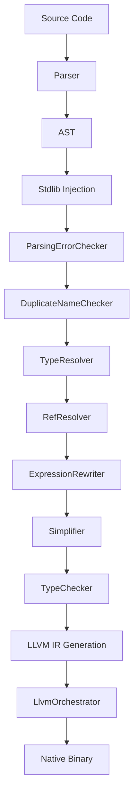

# MML System Patterns

## System Architecture

MinnieML is implemented as a multi-stage compiler with a pipeline architecture. Based on examining the codebase, the compilation process follows these stages:

1. **Parsing**: Converts source code text into an AST (Abstract Syntax Tree)
2. **Semantic Analysis**: Performs checks and transformations on the AST
3. **Code Generation**: Converts the AST to LLVM IR
4. **Native Code Generation**: Converts LLVM IR to executable binaries

The compiler is structured into multiple modules:

- `mmlc`: The compiler frontend and CLI
- `mmlc-lib`: The core compiler implementation

## Key Technical Decisions

### Functional Core Architecture

- The compiler uses a pure functional approach with immutable data structures
- Error handling is done through `Either[CompilationError, T]` for functional error propagation
- Cats and Cats Effect are used for functional programming patterns

### Current Implementation Notes

- **Error Handling:** The compiler accumulates errors through semantic phases using `SemanticPhaseState`, reporting multiple errors instead of failing on the first one
- **Semantic API Access:** `SemanticApi.rewriteModule` returns the final `SemanticPhaseState`, while `CompilerApi.compileState` exposes it to callers; `compileString` preserves the fail-fast behavior by turning non-empty semantic errors into `CompilerError.SemanticErrors`
- **Type Resolution:** TypeResolver follows RefResolver pattern, resolving type references throughout the AST
- **Expression Rewriting:** Unified system treats operators and function application uniformly, rewriting operators as curried function applications
- **Predefined Types:** The semantic package automatically injects common types (String, CharPtr, SizeT, Int64, Float64, Bool, etc.) into every module. When writing tests or examples, use unique names to avoid conflicts with these predefined types

## Key Patterns

- **Functional Core**: Pure functions with explicit error handling via `Either`
- **Effect Separation**: IO effects isolated to API layer using `CompilerEffect`
- **Phase Architecture**: Each semantic phase is a separate module with clear input/output
- **Error Accumulation**: Semantic phases collect errors while continuing analysis
- **AST Rewriting**: Multiple passes transform the AST incrementally

## Scala compiler for MML language

The compiler being written in Scala is a temporary situation.
The goal is to reach self hosting, eventually.

## Compilation Flow

### Entry Points for Understanding

1. **Language Syntax**: Start with `mml.mmlclib.parser` package and see example `.mml` files in `mml/samples/`
2. **AST Structure**: Read `mml.mmlclib.ast` package for all node types
3. **Compilation Pipeline**: Follow `CompilationPipeline.scala` → `SemanticApi.scala` and read the `mml.mmlclib.semantic` package.
4. **Error Handling**: See `SemanticPhaseState` in `semantic/package.scala`
5. **Code Generation**: Start with `mml.mmlclib.codegen.LlvmIrEmitter.scala`, then specialized emitters
6. **Misc Debugging tools**: rewrrite in the yolo package. also the prettyprinter.
7. **Testing**: Grammar suites live under `modules/mmlc-lib/src/test/scala/mml/mmlclib/grammar/`, semantic suites under `.../semantic/`, and shared helpers (e.g., `BaseEffFunSuite` with `semState`) under `.../test/`.

## How to compile and run samples

* example file to compile: `mml/samples/concat_print_string.mml`
* clean compiler workdir by running: `sbt "run clean"` 
* compile: `sbt "run bin mml/samples/concat_print_string.mml"`
* inspect ast: `sbt "run ast mml/samples/concat_print_string.mml"`
* the compiler working directory (output) is `build/`
* run the executable: `./build/target/ConcatPrintString-x86_64-apple-macosx`

Remember that the `bin` command wants to compile an executable and will fail if there is no main.
If there is no main, just replace `bin` in the examples above with `lib`, which will generate 
a native library.
