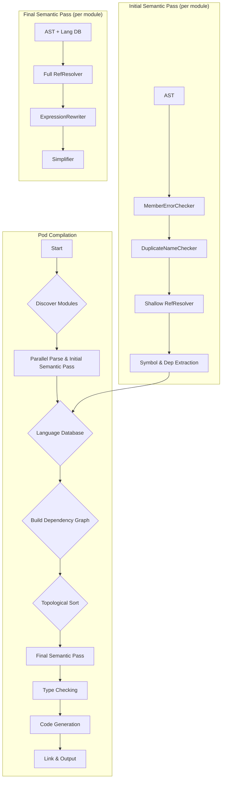

# Multi-Module Compilation Strategy

This document outlines a strategy for compiling projects composed of multiple modules, which we will call "pods".

## The "Pod" Concept

A **pod** is the fundamental unit of compilation. It's a collection of one or more MML modules that are compiled together.

-   **Discovery**: The compiler will be pointed to either a directory or a single file.
    -   If a directory is specified, the compiler will look for an optional `pod.mml` file (the "podfile", similar to `mod.rs` or `lib.rs` in Rust). If found, it will be used for configuration. If not found, the directory is treated as an implicit pod with default settings.
    -   If a single file is specified, it is treated as a single-file pod with default settings.
-   **Configuration**: The optional `pod.mml` file (podfile) is an MML language file that uses special metadata constructs (new language features specifically for pod configuration) to specify:
    -   `name`: The name of the pod.
    -   `target`: The output type, one of `lib`, `bin`, or `pod`.
    -   `bin`: Generates a native binary executable.
    -   `lib`: Generates a native linkable object file.
    -   `pod`: Generates a binary representation of the compiled pod with `.mmlp` extension (a serialized, typed AST, possibly in Parquet format). This binary pod contains ALL the information necessary to generate symbol tables and later produce native code. When another pod includes this binary pod, the compiler reads the `.mmlp` file and reconstructs the symbol table without needing the original source.
    -   `arch`: The target architecture (defaults to the host architecture).
    -   `dependencies`: A list of other pods that this pod depends on.
-   **CLI Changes**: The `mmlc` CLI will need to be updated to accept a pod path (directory or file) instead of just a single source file.
-   **Module Visibility**: Modules within a pod can use the existing visibility modifiers (`public`, `private`, `protected`) to control their accessibility from other modules and pods.

## Compilation Pipeline for Pods

The compilation process for a pod needs to be orchestrated to handle inter-module dependencies correctly. The key is to split the semantic analysis phase into two distinct parts to allow for parallel processing and deferred resolution.

### Phase 1: Parallel Parsing and Initial Analysis

1.  **Module Discovery**: The compiler first identifies all `.mml` files within the pod's directory structure.
    -   Modules without an explicit `module` declaration will have their module name inferred from their file path.
    -   Subdirectories can represent nested module structures.
2.  **Parallel Parsing**: All discovered modules are parsed into their respective ASTs in parallel.
3.  **Initial Semantic Pass (per module)**: For each module, a preliminary semantic pass is run. This pass includes:
    -   `MemberErrorChecker`: To identify and flag any parsing errors.
    -   `DuplicateNameChecker`: To find duplicate names within the module itself.
    -   `RefResolver` (Shallow Pass): This pass will resolve all references that point to definitions *within the same module*. For external references (imports), it will simply record them as unresolved dependencies.
4.  **Symbol Table Generation**: After the initial pass, each module's public and protected symbols (names, types, operator precedence/associativity) are extracted and written to a shared "Language Database". This database will also track the unresolved dependencies for each module.

### Phase 2: Dependency Resolution and Final Compilation

1.  **Dependency Graph**: Using the information from the Language Database, a dependency graph of the modules is constructed.
2.  **Circular Dependency Detection**: The compiler checks for circular dependencies between modules. If detected, compilation fails with an error. MML follows Python's approach and disallows circular module dependencies to maintain a clean dependency hierarchy.
3.  **Topological Sort**: The modules are sorted topologically based on their dependencies. This gives us a linear compilation order.
4.  **Final Semantic Pass (per module, in order)**: The compiler now iterates through the modules in the determined order and performs the second part of the semantic analysis:
    -   **External Reference Resolution**: The `RefResolver` runs a second time, this time resolving the previously recorded external dependencies by looking them up in the now-populated Language Database. This pass can identify the type of each reference (function, operator, etc.) and fetch necessary metadata like operator precedence.
    -   **Expression Rewriting**: With all references resolved, the `ExpressionRewriter` can safely transform the AST.
    -   **Simplification**: The `Simplifier` runs as before.
5.  **Type Checking**: Once a module has passed the final semantic phase, it can proceed to type checking.

### Phase 3: Code Generation and Linking

The final output depends on the `target` specified in the pod configuration.

-   **For `bin` and `lib` targets**:
    1.  **Individual Module Compilation**: Each module, after it has been type-checked, is individually compiled into an object file (`.o`). This can be done in parallel for modules that don't have dependencies on each other.
    2.  **Linking**: Once all modules in the pod have been compiled to object files, the final linking step occurs. The linker will combine all the object files into a single executable or library.
    3.  **Dependency Linking**: The linker will also need to link against any dependent pods. If a dependency is a native library, it will be linked directly. If it's a `.pod` file, the compiler will first perform code generation for the necessary parts of that pod before linking.

-   **For `pod` target**:
    1.  **AST Serialization**: After the final semantic pass and type checking, the ASTs for all modules in the pod are serialized into a single binary `.mmlp` file (e.g., using Apache Parquet). This binary pod contains:
        -   The complete typed AST with all information needed for symbol table generation and native code generation
        -   A list of pod dependencies that this pod requires
        -   All public and protected definitions accessible to other pods
        -   No native code is generated at this stage - the binary pod serves as a portable, platform-independent representation

### Diagram of the New Pipeline

### Supporting Infrastructure

-   **Language Database**: A persistent, file-based database (SQLite or libSQL) will be used to store symbol tables, dependencies, and error information for each module. This provides a flexible querying mechanism and allows for caching of build artifacts between runs, improving performance.
-   **Error Accumulation and Persistence**: The current compiler already accumulates errors during a single run. This will be extended to persist these errors in the Language Database. This allows IDEs and other tools to query for the last known errors for a module without triggering a full recompile.

**Note** I am open to use parquet for this, too, and write some simple lookup functions.
We are on design phase, and changes are expected.

### Incremental Compilation

To support incremental compilation, the system will:

1.  **Content Hashing**: Generate a hash for each module's source content.
2.  **Change Detection**: When a module's hash changes from the previous compilation:
    -   Mark the module as dirty and requiring recompilation.
    -   Mark all modules that depend on it (directly or transitively) as requiring re-analysis.
3.  **Selective Recompilation**: Only recompile modules that have changed or whose dependencies have changed.
4.  **Cache Management**: The Language Database stores the hash and compilation artifacts for each module, enabling fast incremental builds.

### Dependency Management

**Note**: Dependency management (downloading and resolving transitive pod dependencies) is outside the scope of this document. A future build system will handle automatic dependency resolution and downloading. For now, pod dependencies must be managed manually by ensuring required binary pods are available in the expected locations.

It is important to note, tho, that since dependency information is present in the pod, providing this functionality should be rather straightforward and might be included in the compiler.

At the very least, the compiler should be able to be queried for external pod names. then whatever scheme is used to resolve them into urls can be applied.
