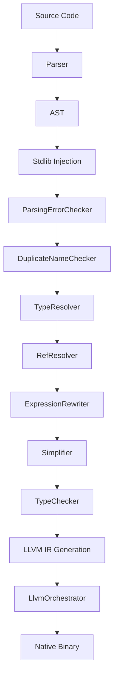

# MinnieML: Language Semantics and Compiler Architecture

This document is divided into two parts: **Part I** describes the language semantics (what MML programs mean), while **Part II** describes the compiler implementation (how those programs are processed).

---

# Part I: Language Semantics

This section describes the semantics of the MinnieML language: its syntax, type system, and behavioral rules.

## Table of Contents - Part I
1. [Lexical Rules](#1-lexical-rules)
2. [Type System](#2-type-system)
3. [Operator System](#3-operator-system)
4. [Semantic Rules](#4-semantic-rules)
5. [Error Categories](#5-error-categories)

---

## 1. Lexical Rules

### Identifiers

MML has distinct lexical rules for different kinds of identifiers:

#### Binding Identifiers (Variables, Functions)
- **Pattern**: `[a-z][a-zA-Z0-9_]*`
- **Must start with**: Lowercase letter `a-z`
- **Can contain**: Letters, digits, underscores
- **Examples**: `x`, `myValue`, `calculate_sum`

#### Type Identifiers
- **Pattern**: `[A-Z][a-zA-Z0-9]*`
- **Must start with**: Uppercase letter `A-Z`
- **Can contain**: Letters and digits (no underscores)
- **Examples**: `Int`, `String`, `MyType`

#### Operator Identifiers
Operators can be **either symbolic OR alphanumeric**:

**Symbolic operators**:
- **Allowed characters**: `=!#$%^&*+<>?/\|~-`
- **Examples**: `+`, `-`, `==`, `|>`, `>>`

**Alphanumeric operators**:
- **Pattern**: Same as binding identifiers: `[a-z][a-zA-Z0-9_]*`
- **Examples**: `and`, `or`, `mod`, `div`

### Keywords

Reserved words that cannot be used as identifiers:

```
let, fn, op, type, module, if, then, else, @native, ??? (hole), _ (placeholder)
```

### Literals

#### Numeric Literals
- **Integers**: `[0-9]+` → `LiteralInt`
  - Examples: `42`, `0`, `1234`
- **Floats**: `[0-9]+\.[0-9]+` or `\.[0-9]+` → `LiteralFloat`
  - Examples: `3.14`, `.5`, `0.001`

#### String Literals
- **Pattern**: `"[^"]*"` (raw content, no escape processing during parsing)
- **Multiline support**: Yes, newlines and special characters are preserved
- **Escape handling**: Performed at code generation time using LLVM hex escapes
- **Examples**: `"hello"`, `"world"`, `"line 1\nline 2"` (literal newline in source)

#### Boolean Literals
- **Values**: `true`, `false`

#### Unit Literal
- **Syntax**: `()`
- **Type**: `Unit` (the only inhabitant of the Unit type)

### Comments

#### Line Comments
- **Syntax**: `# comment text`
- **Scope**: From `#` to end of line

#### Documentation Comments
- **Syntax**: `#- ... -#`
- **Purpose**: Attached to members for documentation
- **Can nest**: `#- outer #- inner -# -#`

---

## 2. Type System

### Basic Types

MML provides a set of basic types that map directly to LLVM types:

```scala
Int64, Int32, Int16, Int8      // Signed integers
Float, Double                  // Floating point
Bool                           // Boolean (i1)
Char                           // Character (i8)
Unit                           // Unit type (void)
String                         // Struct with length and data pointer
```

**Type Aliases**:
```mml
Int   → Int64   // Default integer type
Byte  → Int8
Word  → Int8
```

### Native Type Declarations

MML allows declaring types that mirror native C/LLVM types. These declarations **lift native types into MML's type system** without defining the types themselves.

**Three forms of native types**:

```rust
# Primitive type with native representation
type SizeT = @native:i64

# Opaque pointer
type CharPtr = @native:*i8

# Struct mirror
type String = @native {
  length: SizeT,
  data:   CharPtr
}
```

**Primitive Types**: Each `@native:<repr>` declaration defines a **distinct fundamental type**. In other languages, primitives like `int` or `float` are hardcoded into the compiler. MML gives users the ability to define their own primitives via `@native`.

```rust
type Int64 = @native:i64
type AnotherInt64 = @native:i64

# These are DIFFERENT types - two distinct primitives
# Even though both wrap i64, they are separate fundamental types
# A function expecting Int64 won't accept AnotherInt64
```

**Native Structs**: Native struct type declarations are **mirrors**, not definitions. The actual type definition exists in the linked C runtime (`mml_runtime.c`). MML uses these declarations to understand memory layout and generate correct IR.


### Function Types

Functions have types of the form `T1 → T2 → ... → Tn → R`, where:
- `T1, T2, ..., Tn` are parameter types
- `R` is the return type
- Functions are curried (each arrow represents a function taking one argument)

**Examples**:
```rust
fn add(a: Int, b: Int): Int = a + b;
# Type: Int → Int → Int

fn print(s: String): Unit = @native;
# Type: String → Unit
```

### Type Compatibility

Two types are compatible if:
1. They are the same type (same name)
2. One is a type alias that resolves to the other

**Important for Native Types**: Each `@native` declaration creates a distinct fundamental type. The type checker treats these as opaque primitives and does not look at their underlying representation:
- `Int64` and `AnotherInt64` (both `@native:i64`) are **incompatible** - they are different primitives
- The type checker cannot see that both wrap `i64`; it treats each `@native` declaration as a separate fundamental type

### Compound Types

**Tuples**: `(T1, T2, ..., Tn)`
```mml
let pair: (Int, String) = (42, "hello");
```

**Function types**: `T1 → T2 → R`
```mml
let f: Int → Int → Int = add;
```

**Type variables**: `'T`, `'R`, etc. (for future polymorphism support)

---

## 3. Operator System

### User-Defined Operators

**All operators in MML are user-defined**, including fundamental arithmetic and logical operators. There are no built-in operators in the language itself.

The standard operators like `+`, `-`, `*`, `/`, `==`, `and`, etc. are **injected by the compiler** into every module (see `semantic/package.scala`). From the language's perspective, these are ordinary user-defined operators with no special status.

**Example operator definition**:
```mml
op +(a: Int, b: Int): Int precedence 60 left = @native;
op *(a: Int, b: Int): Int precedence 80 left = @native;
```

### Operator Kinds

MML supports two kinds of operators:

1. **Binary operators** (`BinOpDef`): Take two operands
   - Syntax: `op NAME(param1, param2): ReturnType precedence N ASSOC = body;`
   - Example: `op +(a: Int, b: Int): Int precedence 60 left = ...;`

2. **Unary operators** (`UnaryOpDef`): Take one operand
   - Syntax: `op NAME(param): ReturnType precedence N ASSOC = body;`
   - Example: `op -(a: Int): Int precedence 95 right = ...;`

### Operator Overloading

**Operators can be overloaded by arity**:
- A binary operator and a unary operator **can share the same name**
- Example: Binary `-` (subtraction) and unary `-` (negation) coexist

**Functions cannot be overloaded**:
- Each function name (`FnDef`) must be unique within a scope.
- Functions and operators with the same name are **not allowed**

**Overloading rules**:
```rust
# Valid: unary and binary - coexist
op -(a: Int): Int precedence 95 right = ???;      # Unary negation
op -(a: Int, b: Int): Int precedence 60 left = ???; # Binary subtraction

# Invalid: duplicate binary operator
op +(a: Int, b: Int): Int = ???;
op +(x: Float, y: Float): Float = ???;  # ERROR: duplicate name

# Invalid: function and operator with same name
fn foo(x: Int): Int = x;
op foo(a: Int, b: Int): Int = a + b;  # ERROR: name conflict
```

### Precedence and Associativity

Every operator has:
- **Precedence**: Integer value (higher binds tighter)
- **Associativity**: `left` or `right`

**Standard precedence levels**:
```
95: Unary operators (prefix: +, -, not)
80: Multiplicative (*, /)
60: Additive (+, -)
50: Comparison (==, !=, <, >, <=, >=)
40: Logical and
30: Logical or
```

These are **conventional values** used by the injected standard operators, not language-enforced rules. User-defined operators can use any precedence value.

### Operators as Functions

Operators are syntactic sugar for function calls:
```mml
1 + 2      # Desugars to: + 1 2
-5         # Desugars to: - 5
a * b + c  # Desugars to: + (* a b) c
```

---

## 4. Semantic Rules

### Function Application

**Currying**: Functions are curried, meaning multi-parameter functions desugar to nested single-parameter applications: `f a b` is really `((f a) b)`.

```mml
fn add(a: Int, b: Int): Int = a + b;

let add5 = add 5;       # Partial application: Int → Int
let result = add5 10;   # Full application: 15
```

**Juxtaposition**: Function application is written as juxtaposition: `f x` means "apply f to x".

### Nullary Functions

Functions with zero parameters require special handling:

**In call position**: Explicitly applied to unit
```mml
fn get_value(): Int = 42;
let x = get_value ();  # Explicit application to unit literal
```

**In value position**: Auto-wrapped with unit argument
```mml
let f = get_value;    # Desugars to: get_value ()
```

This ensures that nullary functions are always called, never passed as values (since MML doesn't have first-class functions yet).

### Conditional Expressions

```mml
if condition then expr1 else expr2;
```

**Rules**:
- `condition` must have type `Bool`
- `expr1` and `expr2` must have the same type
- The entire expression has the type of the branches

### Native Declarations

Functions and operators can have `@native` bodies, indicating external implementation:

```mml
fn print(s: String): Unit = @native;
op +(a: Int, b: Int): Int precedence 60 left = @native;
```

**Purpose**: Lift native (C/LLVM) functions into MML's type system by declaring their signatures. The type annotations define the interface contract.
             The codegen will generate forward declarations in each module using these functions and the linker will resolve them
             If they are not found a linker error will occur.

---

## 5. Error Categories

### Semantic Errors

Errors related to names and references:
- **`UndefinedRef`**: Reference to undefined variable, function, or parameter
- **`UndefinedTypeRef`**: Reference to undefined type
- **`DuplicateName`**: Multiple declarations with the same name in a module

Expression structure errors:
- **`InvalidExpression`**: Malformed expression that cannot be processed
- **`DanglingTerms`**: Terms that appear in invalid positions

### Type Errors

Parameter and return type errors:
- **`MissingParameterType`**: Function parameter lacks required type annotation
- **`MissingReturnType`**: Function lacks return type (when inference is not possible)

Application errors:
- **`TypeMismatch`**: Expected type T1, got type T2
- **`InvalidApplication`**: Attempting to call a non-function
- **`UndersaturatedApplication`**: Too few arguments provided
- **`OversaturatedApplication`**: Too many arguments provided

Conditional errors:
- **`ConditionalBranchTypeMismatch`**: `if` branches have different types
- **`ConditionalGuardTypeMismatch`**: Condition is not `Bool`

---

# Part II: Compiler Implementation

This section describes how the MML compiler processes programs: its internal data structures, algorithms, and transformation phases.

## Table of Contents - Part II
6. [AST Structure](#6-ast-structure)
7. [Parser Architecture](#7-parser-architecture)
8. [Semantic Phase Pipeline](#8-semantic-phase-pipeline)
9. [Standard Library Injection](#9-standard-library-injection)
10. [Error Handling Strategy](#10-error-handling-strategy)
Appendix A. [Source Tree Overview](#appendix-a-source-tree-overview)

---

## 6. AST Structure

The Abstract Syntax Tree is organized into several key node categories.

### Core Traits

#### `AstNode`
Base trait for all AST nodes.

#### `FromSource`
Nodes that have source location information (`SrcSpan`).

#### `Typeable`
Nodes that can have types, containing:
- `typeSpec: Option[TypeSpec]` - **Computed type** by the compiler
- `typeAsc: Option[TypeSpec]` - **User-declared type** from source

#### `Resolvable`
Nodes that can be referenced by name (all `Decl` types, `FnParam`).

### Module Structure

```scala
Module(
  span: SrcSpan,
  name: String,
  visibility: ModVisibility,  // Public, Lexical, Protected
  members: List[Member],
  docComment: Option[DocComment]
)
```

- **Top-level modules**: The CLI/test harness always provides a module name derived from the source path; there is no `module` keyword at file scope. The parser simply collects top-level members until EOF and wraps them in a `Module` with `ModVisibility.Public`.
- **Doc comments**: File-level doc comments apply to the first member; the parser does not attach them to the synthetic top-level module node.

### Members

Top-level declarations in a module:

#### Declarations (`Decl`)
All declarations extend `Decl` trait and include:
- `FnDef` - Function definitions
- `BinOpDef` - Binary operator definitions (e.g., `+`, `-`, `==`)
- `UnaryOpDef` - Unary operator definitions (e.g., unary `-`, `not`)
- `Bnd` - Value bindings (including lambdas)
- `TypeDef` - New type definitions
- `TypeAlias` - Type aliases


### Terms

Expressions are built from terms:

#### Expression Structures
- **`Expr`**: Sequence of terms that form an expression
- **`TermGroup`**: Parenthesized expression `(expr)`
- **`Cond`**: Conditional expression `if cond then expr1 else expr2`
- **`App`**: Function application (curried: `f x y` becomes `((f x) y)`)
  - Note: `fn` field is constrained to `Ref | App` to enforce curried structure
- **`Lambda`**: Reserved node for lambda literals (parser does not emit these yet)

#### Values
- **`Ref`**: Reference to a declaration or parameter
  - Contains `resolvedAs: Option[Resolvable]` - what it resolves to
  - Contains `candidates: List[Resolvable]` - potential resolutions during name resolution
- **`LiteralInt`, `LiteralFloat`, `LiteralString`, `LiteralBool`, `LiteralUnit`**
- **`Tuple`**: Tuple of expressions `(expr1, expr2, ...)`
- **`Placeholder`**: Pattern matching placeholder `_`
- **`Hole`**: Typed hole `???` (for incomplete code)

### Type Specifications (`TypeSpec`)

```scala
// Type references
TypeRef(name: String, resolvedAs: Option[ResolvableType])

// Native types (from C/LLVM)
NativePrimitive(llvmType: String)        // e.g., "i64", "float"
NativePointer(llvmType: String)          // e.g., "*i8"
NativeStruct(fields: Map[String, TypeSpec])

// Function types
TypeFn(paramTypes: List[TypeSpec], returnType: TypeSpec)

// Compound types
TypeTuple(elements: List[TypeSpec])
TypeStruct(fields: List[(String, TypeSpec)])
Union(types: List[TypeSpec])             // Int | String
Intersection(types: List[TypeSpec])      // Readable & Writable
TypeApplication(base: TypeSpec, args: List[TypeSpec])

// Type schemes (polymorphism)
TypeScheme(vars: List[String], bodyType: TypeSpec)  // ∀'T. 'T → 'T
TypeVariable(name: String)                          // 'T, 'R, etc.
```

### Error/Invalid Nodes

For error recovery and LSP support:

- **`InvalidExpression`**: Wraps unresolvable expressions
- **`InvalidType`**: Wraps unresolvable type references
- **`DuplicateMember`**: Marks duplicate declarations
- **`InvalidMember`**: Members with structural errors
- **`ParsingMemberError`**: Parse errors at member level
- **`TermError`**: Expression-level parse errors

---

## 7. Parser Architecture

The parser uses **FastParse** combinators and follows these principles:

### Whitespace Handling

- **No significant indentation**: Whitespace is not syntactically meaningful
- **Custom whitespace handler** (`MmlWhitespace`):
  - Consumes spaces, tabs, newlines, carriage returns
  - Handles line comments starting with `#` (e.g., `# this is a comment`)
  - Preserves `#-` and `-#` tokens for doc comment parser

**Implementation**: State machine with two states:
- State 0: Normal whitespace consumption
- State 1: Inside line comment (consume until newline)

### Expression Parsing Strategy

Expressions are parsed as **sequences of terms** that are later restructured by the `ExpressionRewriter` phase using precedence climbing.

**Example**:
```mml
let result = 1 + 2 * 3;
```
- **Parser output**: `Expr(terms = [Ref("1"), Ref("+"), Ref("2"), Ref("*"), Ref("3")])`
- **After ExpressionRewriter**: Properly nested `App` nodes respecting precedence

**Rationale**: This approach simplifies parsing and defers precedence handling to semantic analysis, enabling better error recovery and making operator precedence extensible.

### Member Parsing

Top-level module members are parsed independently:
- `fnKw` → `FnDef`
- `opKw` → `BinOpDef` or `UnaryOpDef`
- `letKw` → `Bnd`
- `typeKw` → `TypeDef` or `TypeAlias`

---

## 8. Semantic Phase Pipeline

The semantic analysis happens in **seven sequential phases**. Each phase transforms the module AST
and accumulates errors in a `SemanticPhaseState`.

### Phase State

```scala
case class SemanticPhaseState(
  module: Module,
  errors: Vector[SemanticError]
)
```

Each phase receives the current state, transforms the module, potentially adds errors, and returns the updated state.

**Phase order** (from `SemanticApi.scala`):
1. ParsingErrorChecker
2. DuplicateNameChecker
3. TypeResolver
4. RefResolver
5. ExpressionRewriter
6. Simplifier
7. TypeChecker

---

### Phase 1: ParsingErrorChecker

**Purpose**: Report any parse errors that were recovered from during parsing.

**Behavior**:
- Scans module for `ParsingMemberError` and `ParsingIdError` nodes
- Converts them to semantic errors for uniform error reporting
- **Runs FIRST** to surface syntax errors immediately

**Errors Reported**:
- `SemanticError.MemberErrorFound`
- `SemanticError.ParsingIdErrorFound`

**AST Changes**: None, only reports errors

---

### Phase 2: DuplicateNameChecker

**Purpose**: Detect and report duplicate declarations within a module.

**Behavior**:
- Groups declarations by `(name, kind)` key
  - Kinds: `"bin"`, `"unary"`, `"fn"`, `"bnd"`, `"typedef"`, `"typealias"`
- Allows **unary and binary operators** with the same name (e.g., unary `-` and binary `-`)
- **Does NOT allow** functions to have the same name as operators
- First occurrence is kept valid, duplicates are wrapped in `DuplicateMember` nodes
- Also checks for **duplicate parameter names** within functions/operators

**Errors Reported**:
- `SemanticError.DuplicateName`

**AST Changes**:
- Wraps duplicate members in `DuplicateMember` nodes
- Wraps members with duplicate parameters in `InvalidMember` nodes

---

### Phase 3: TypeResolver

**Purpose**: Resolve all `TypeRef` nodes to their type definitions.

**Three-Phase Resolution**:

1. **Build Type Map**: Collect all `TypeDef` and `TypeAlias` into a map
2. **Resolve Type Map**: Resolve `TypeRef` nodes within the definitions themselves (handles nested types like `NativeStruct` fields)
3. **Resolve Members**: Resolve all `TypeRef` nodes in member declarations and expressions

**Behavior**:
- Resolves `TypeRef` nodes in:
  - Type ascriptions (`typeAsc`)
  - Function parameter types
  - Return type declarations
  - Type alias definitions
  - Struct field types
- Computes `typeSpec` for `TypeAlias` by following the chain
- Handles recursive type resolution in compound types (`TypeFn`, `TypeStruct`, etc.)

**Errors Reported**:
- `SemanticError.UndefinedTypeRef`

**AST Changes**:
- Updates `TypeRef.resolvedAs` to point to `TypeDef` or `TypeAlias`
- Computes `TypeAlias.typeSpec` by following resolution chain
- Wraps unresolvable type refs in `InvalidType` nodes

---

### Phase 4: RefResolver

**Purpose**: Resolve all `Ref` nodes to their declarations or parameters.

**Behavior**:
- For each `Ref` in expressions, searches for matching declarations:
  1. First checks **parameters** of the containing function/operator
  2. Then checks **module-level members** (excluding self)
- Populates `Ref.candidates` with all matches
- If exactly one match: sets `Ref.resolvedAs = Some(match)`
- If no matches: wraps expression in `InvalidExpression` node

**Errors Reported**:
- `SemanticError.UndefinedRef`

**AST Changes**:
- Updates `Ref.candidates` and `Ref.resolvedAs` fields
- Wraps unresolvable references in `InvalidExpression` nodes

---

### Phase 5: ExpressionRewriter

**Purpose**: Restructure expressions using **precedence climbing** to build proper AST structure for operators and function application.

**Algorithm**: Precedence climbing with support for:
1. Prefix operators (unary with right associativity)
2. Function application chains (left-associative juxtaposition)
3. Binary operators (with user-defined precedence)
4. Postfix operators (unary with left associativity)

**Function Application as Juxtaposition**:
Function application is treated as a **high-precedence operation** through juxtaposition.

**Example**: `f x y` is parsed as terms `[Ref("f"), Ref("x"), Ref("y")]` and rewritten to `App(App(Ref("f"), x), y)`.

**Nullary Function Handling**:
Functions with zero parameters in value position are **auto-wrapped** with a unit argument:
```mml
fn get_value(): Int = 42;
let x = get_value;  # Rewritten to: let x = get_value ();
```

**Transformations**:
- `1 + 2 * 3` → `App(App(Ref("+"), 1), App(App(Ref("*"), 2), 3))`
- `f x y` → `App(App(Ref("f"), x), y)`
- `-5` → `App(Ref("-"), 5)`

**Errors Reported**:
- `SemanticError.InvalidExpression`
- `SemanticError.DanglingTerms`
- `SemanticError.InvalidExpressionFound`

**AST Changes**:
- Transforms flat `Expr(terms)` into nested `App` structures
- Resolves operator references to their definitions
- Wraps nullary functions with `App(fn, UnitLiteral)`

---

### Phase 6: Simplifier

**Purpose**: Simplify AST structure by removing unnecessary nesting.

**Transformations**:
- **Unwrap single-term expressions**: `Expr([term])` → `term`
- **Remove group wrappers**: `TermGroup(inner)` → inner term
- **Flatten nested expressions**: Recursively simplify all subexpressions

**Examples**:
```scala
// Before: Expr([Expr([Expr([Ref("x")])])])
// After:  Ref("x")

// Before: TermGroup(Expr([Ref("x")]))
// After:  Ref("x")
```

**Behavior**:
- Recursively simplifies all terms
- Preserves `Expr` wrapper for member bodies and conditional branches
- Transfers type ascriptions when unwrapping

**AST Changes**:
- Removes unnecessary `Expr` and `TermGroup` nesting
- Flattens AST for easier processing in later phases

---

### Phase 7: TypeChecker

**Purpose**: Validate member bodies, ensure parameter annotations are present, and infer return types
where possible.

**Two-Phase Flow**

1. **Lower mandatory ascriptions**
   - For `FnDef`, `BinOpDef`, and `UnaryOpDef`, copy each parameter's `typeAsc` into `typeSpec` and
     do the same for the declaration's return type.
   - Missing parameter annotations raise `MissingParameterType` or
     `MissingOperatorParameterType`. Return types may be inferred, so no warning is emitted if they
     are omitted.

2. **Type-check members**
   - Each function/operator body is checked in the context of its parameters. If a return type was
     declared, the computed type must match unless the body is a `@native` stub (see note below). Otherwise, the return type is inferred from the body.
   - `Bnd` bindings run through the same expression checker; their `typeSpec` mirrors the computed
     expression type. Explicit `typeAsc` entries are validated against the inferred result.

**Application Checking**:
- Works over nested `App` chains produced by the rewriter, validating one argument at a time.
- Ensures zero-argument functions in call position accept `Unit`.
- Emits `TypeError.TypeMismatch`, `InvalidApplication`, `UndersaturatedApplication`, or
  `OversaturatedApplication` depending on the shape of the call.

**Additional Rules**:
- After checking, a function or operator's `typeSpec` stores its return type; parameter
  `typeSpec` entries hold the concrete argument types.
- Conditional guards must be `Bool`; both branches must agree on type or trigger
  `ConditionalBranchTypeMismatch`.
- Holes (`???`) require an expected type; otherwise `UntypedHoleInBinding` is reported.
- All detected issues are wrapped as `SemanticError.TypeCheckingError` and accumulated in the phase
  state.

**Note on Native Implementations**:

Functions and operators with `@native` bodies (containing `NativeImpl` nodes) serve to **lift native
declarations and types into MML's type system**. These declarations expose native (C/LLVM)
functionality to MML by declaring their signatures. The type checker skips body verification for
native implementations since the body is external. During code generation, the compiler generates
forward declarations for native functions and uses the structural type information to generate IR
that correctly accesses those types.

---

## 9. Standard Library Injection

The compiler **automatically injects** predefined types, operators, and functions into every module before semantic analysis. This injection is implemented in `semantic/package.scala`.

### Injected Types

```scala
// Native type definitions with LLVM mappings
Int64, Int32, Int16, Int8      // i64, i32, i16, i8
Float, Double                  // float, double
Bool                           // i1
Char                           // i8
SizeT                          // i64
Unit                           // void
CharPtr                        // i8*
String                         // Struct: { length: Int64, data: CharPtr }

// Type aliases
Int   → Int64
Byte  → Int8
Word  → Int8
```

### Injected Operators

All standard operators are injected as `@native` declarations:

```scala
// Arithmetic (Int → Int → Int)
op *(a: Int, b: Int): Int precedence 80 left = @native;
op /(a: Int, b: Int): Int precedence 80 left = @native;
op +(a: Int, b: Int): Int precedence 60 left = @native;
op -(a: Int, b: Int): Int precedence 60 left = @native;

// Unary arithmetic (Int → Int)
op +(a: Int): Int precedence 95 right = @native;
op -(a: Int): Int precedence 95 right = @native;

// Comparison (Int → Int → Bool)
op ==(a: Int, b: Int): Bool precedence 50 left = @native;
op !=(a: Int, b: Int): Bool precedence 50 left = @native;
op <(a: Int, b: Int): Bool precedence 50 left = @native;
op >(a: Int, b: Int): Bool precedence 50 left = @native;
op <=(a: Int, b: Int): Bool precedence 50 left = @native;
op >=(a: Int, b: Int): Bool precedence 50 left = @native;

// Logical (Bool → Bool → Bool)
op and(a: Bool, b: Bool): Bool precedence 40 left = @native;
op or(a: Bool, b: Bool): Bool precedence 30 left = @native;

// Unary logical (Bool → Bool)
op not(a: Bool): Bool precedence 95 right = @native;
```

### Injected Functions

```scala
fn print(s: String): Unit = @native;
fn println(s: String): Unit = @native;
fn concat(a: String, b: String): String = @native;
fn to_string(n: Int): String = @native;
```

**Implementation**: See `injectBasicTypes`, `injectStandardOperators`, and `injectCommonFunctions` in `semantic/package.scala`.

---

## 10. Error Handling Strategy

### Error Accumulation Model

The compiler uses an **error accumulation** model rather than fail-fast:
- Errors are collected in `SemanticPhaseState.errors`
- Compilation continues even after errors are found
- This enables **better IDE support** and reporting **multiple errors** at once

### Invalid Nodes

The compiler wraps invalid constructs in special nodes to continue analysis:

- **`InvalidExpression`**: Unresolvable expressions (e.g., undefined references)
- **`InvalidType`**: Unresolvable type references
- **`DuplicateMember`**: Duplicate declarations (first stays valid)
- **`InvalidMember`**: Members with errors (e.g., duplicate parameters)

**Benefits**:
- **Partial compilation**: Generate code for valid parts
- **LSP support**: Continue providing IDE features despite errors
- **Better error messages**: More context available

### Error Types

#### `SemanticError`
General semantic analysis errors (see Part I, Error Categories)

#### `TypeError`
Type system errors (see Part I, Error Categories)

All type errors are wrapped as `SemanticError.TypeCheckingError` for uniform handling in the phase pipeline.

## Appendix A: Source Tree Overview

### Compilation Flow



### Module Organization

**Compiler Frontend** (`modules/mmlc/`)
- `Main.scala` - Entry point, CLI handling
- `CommandLineConfig.scala` - Command-line argument definitions
- `CompilationPipeline.scala` - Orchestrates the full compilation process
- `CodeGeneration.scala` - Native code generation coordination
- `FileOperations.scala` - File I/O utilities

**Core Compiler Library** (`modules/mmlc-lib/`)

#### AST (`ast/`)
- `AstNode.scala` - All AST node definitions (Module, Member, Expr, Term, TypeSpec, etc.)

#### Parser (`parser/`)
- `Parser.scala` - FastParse-based parser implementation
- `MmlWhitespace.scala` - Custom whitespace handling for significant indentation

#### Semantic Analysis (`semantic/`)
- `package.scala` - `SemanticPhaseState` for error accumulation
- `ParsingErrorChecker.scala` - Reports parser errors that made it through
- `DuplicateNameChecker.scala` - First phase, checks for duplicate definitions
- `TypeResolver.scala` - Resolves type references to type definitions
- `RefResolver.scala` - Collects candidate definitions for each reference
- `ExpressionRewriter.scala` - Unified precedence-based expression restructuring
- `Simplifier.scala` - Final AST simplification before codegen

#### Code Generation (`codegen/`)
- `LlvmIrEmitter.scala` - Main LLVM IR generation
- `LlvmOrchestrator.scala` - Coordinates LLVM toolchain, runtime linking
- `emitter/` - Specialized emitters:
  - `ExpressionCompiler.scala` - Expression to LLVM IR
  - `FunctionEmitter.scala` - Function definitions
  - `OperatorEmitter.scala` - Operator definitions
  - `Module.scala` - Module-level emission

#### APIs (`api/`)
- `EffectTypes.scala` - `CompilerEffect[T]` type alias
- `ParserApi.scala` - Parsing API
- `SemanticApi.scala` - Semantic analysis pipeline
- `CompilerApi.scala` - Combined parsing + semantic
- `CodeGenApi.scala` - Code generation API
- `NativeEmitterApi.scala` - Native binary emission

#### Errors (`errors/`)
- Error type definitions for each compilation phase

#### Utilities (`util/`)
- `prettyprint/ast/` - AST pretty printing for debugging
- `error/print/` - Error formatting and display
- `pipe/` - Functional pipeline operator
- `yolo/` - Quick debugging utilities

### Test Structure

**Grammar Tests** (`modules/mmlc-lib/src/test/scala/mml/mmlclib/grammar/`)
- Parser-focused tests for each language construct
- `BaseParserSuite` - Common test utilities

**Semantic Tests** (`modules/mmlc-lib/src/test/scala/mml/mmlclib/semantic/`)
- Tests for each semantic analysis phase
- Integration tests for the full semantic pipeline

**Test Helpers** (`modules/mmlc-lib/src/test/scala/mml/mmlclib/test/`)
- `BaseEffFunSuite` - Base class for effect-based tests
- Common test utilities and assertions

## Summary

The MML compiler follows a **multi-phase transformation pipeline**:

1. **Parsing**: Source → AST (flat expression structures)
2. **ParsingErrorChecker**: Report parse errors from recovery
3. **DuplicateNameChecker**: Detect name collisions
4. **TypeResolver**: Resolve type references
5. **RefResolver**: Link references to declarations
6. **ExpressionRewriter**: Build operator precedence and application structure
7. **Simplifier**: Remove unnecessary nesting
8. **TypeChecker**: Validate and infer types

Each phase:
- Receives `SemanticPhaseState` with current module + accumulated errors
- Transforms the AST
- Returns updated state with new errors (if any)

This design enables:
- **Clear separation of concerns**: Each phase has one responsibility
- **Error recovery**: Continue analysis after errors
- **Incremental development**: Easy to add new phases
- **Better tooling**: Partial results enable IDE features

---

## Reference

- **Codebase structure**: See `memory-bank/systemPatterns.md`
- **Operator overloading**: See `memory-bank/specs/operator-arity-mangling.md`
- **Codegen update**: See `memory-bank/specs/codegen-update.md`
