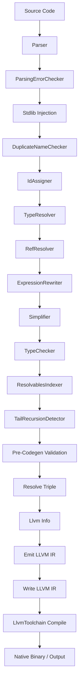

# MinnieML: Compiler Implementation

This document describes how the MML compiler processes programs: its internal data structures, algorithms, and transformation phases.

## Table of Contents
6. [AST Structure](#6-ast-structure)
7. [Parser Architecture](#7-parser-architecture)
8. [Semantic Phase Pipeline](#8-semantic-phase-pipeline)
9. [Standard Library Injection](#9-standard-library-injection)
10. [Error Handling Strategy](#10-error-handling-strategy)
11. [Code Generation: Native Templates](#11-code-generation-native-templates)
Appendix A. [Source Tree Overview](#appendix-a-source-tree-overview)

---

## 6. AST Structure

The Abstract Syntax Tree is organized into several key node categories.

### Core Traits

#### `AstNode`
Base trait for all AST nodes.

#### `FromSource`
Nodes that have source location information (`SrcSpan`).

#### `Typeable`
Nodes that can have types, containing:
- `typeSpec: Option[TypeSpec]` - **Computed type** by the compiler
- `typeAsc: Option[TypeSpec]` - **User-declared type** from source

#### `Resolvable`
Nodes that can be referenced by name (all `Decl` types, `FnParam`). Each `Resolvable` (and
`ResolvableType`) carries a stable `id: Option[String]` used for soft references.

### Module Structure

```scala
Module(
  span: SrcSpan,
  name: String,
  visibility: Visibility,  // Public, Protected, Private
  members: List[Member],
  docComment: Option[DocComment],
  sourcePath: Option[String],
  resolvables: ResolvablesIndex
)
```

- **Top-level modules**: The CLI/test harness always provides a module name derived from the source path; there is no `module` keyword at file scope. The parser simply collects top-level members until EOF and wraps them in a `Module` with `Visibility.Public`.
- **Doc comments**: File-level doc comments apply to the first member; the parser does not attach them to the synthetic top-level module node.
- **Visibility**: Three levels (`Public`, `Protected`, `Private`) are carried in the AST for future access control; not enforced yet. See semantics doc for meaning.

### Members

Top-level declarations in a module:

#### Declarations (`Decl`)
All declarations extend `Decl` trait and include:
- `Bnd` - All value bindings, functions, and operators (with `Lambda` body and optional `BindingMeta`)
- `TypeDef` - New type definitions
- `TypeAlias` - Type aliases

**Bnd with BindingMeta**: Functions and operators are represented as `Bnd` nodes containing a `Lambda` body and `BindingMeta`:
```scala
Bnd(
  name: String,           // mangled name for operators (e.g., "op.plus.2")
  value: Expr,            // contains Lambda with params and body
  meta: Option[BindingMeta], // origin, arity, precedence, associativity, originalName
  id: Option[String]         // stable soft-reference ID
)
```


### Terms

Expressions are built from terms:

#### Expression Structures
- **`Expr`**: Sequence of terms that form an expression
- **`TermGroup`**: Parenthesized expression `(expr)`
- **`Cond`**: Conditional expression `if cond then expr1 else expr2`
- **`App`**: Function application (curried: `f x y` becomes `((f x) y)`)
  - Note: `fn` field is constrained to `Ref | App` to enforce curried structure
- **`Lambda`**: Reserved node for lambda literals (parser does not emit these yet)

#### Values
- **`Ref`**: Reference to a declaration or parameter
  - Contains `resolvedId: Option[String]` - ID of the resolved target (soft reference)
  - Contains `candidateIds: List[String]` - potential resolution IDs during name resolution
- **`LiteralInt`, `LiteralFloat`, `LiteralString`, `LiteralBool`, `LiteralUnit`**
- **`Tuple`**: Tuple of expressions `(expr1, expr2, ...)`
- **`Placeholder`**: Pattern matching placeholder `_`
- **`Hole`**: Typed hole `???` (for incomplete code)

### Type Specifications (`TypeSpec`)

```scala
// Type references
TypeRef(name: String, resolvedId: Option[String], candidateIds: List[String])

// Native types (from C/LLVM)
NativePrimitive(llvmType: String)        // e.g., "i64", "float"
NativePointer(llvmType: String)          // e.g., "*i8"
NativeStruct(fields: Map[String, TypeSpec])

// Function types
TypeFn(paramTypes: List[TypeSpec], returnType: TypeSpec)

// Compound types
TypeTuple(elements: List[TypeSpec])
TypeStruct(fields: List[(String, TypeSpec)])
Union(types: List[TypeSpec])             // Int | String
Intersection(types: List[TypeSpec])      // Readable & Writable
TypeApplication(base: TypeSpec, args: List[TypeSpec])

// Type schemes (polymorphism)
TypeScheme(vars: List[String], bodyType: TypeSpec)  // ∀'T. 'T → 'T
TypeVariable(name: String)                          // 'T, 'R, etc.
```

- **Type definitions**: `TypeDef`, `TypeAlias`, and `TypeStruct` are `ResolvableType` nodes with
  stable IDs; `Field` (struct fields) is also `Resolvable` and carries an ID.

### Error/Invalid Nodes

For error recovery and LSP support:

- **`InvalidExpression`**: Wraps unresolvable expressions
- **`InvalidType`**: Wraps unresolvable type references
- **`DuplicateMember`**: Marks duplicate declarations
- **`InvalidMember`**: Members with structural errors
- **`ParsingMemberError`**: Parse errors at member level
- **`TermError`**: Expression-level parse errors

### Soft References and ResolvablesIndex

- All resolvable nodes (top-level declarations, struct fields, lambda parameters) carry stable IDs.
- `Ref`/`TypeRef` store those IDs (`resolvedId`/`candidateIds`) instead of object references.
- `Module.resolvables: ResolvablesIndex` maps IDs to the current AST nodes and is kept in sync as
  phases rewrite members. Consumers (LSP, codegen, printers) always reify through this index to get
  the latest node instance.

---

## 7. Parser Architecture

The parser uses **FastParse** combinators and follows these principles:

### Whitespace Handling

- **No significant indentation**: Whitespace is not syntactically meaningful
- **Custom whitespace handler** (`MmlWhitespace`):
  - Consumes spaces, tabs, newlines, carriage returns
  - Handles line comments starting with `#` (e.g., `# this is a comment`)
  - Preserves `#-` and `-#` tokens for doc comment parser

**Implementation**: State machine with two states:
- State 0: Normal whitespace consumption
- State 1: Inside line comment (consume until newline)

### Expression Parsing Strategy

Expressions are parsed as **sequences of terms** that are later restructured by the `ExpressionRewriter` phase using precedence climbing.

**Example**:
```mml
let result = 1 + 2 * 3;
```
- **Parser output**: `Expr(terms = [Ref("1"), Ref("+"), Ref("2"), Ref("*"), Ref("3")])`
- **After ExpressionRewriter**: Properly nested `App` nodes respecting precedence

**Rationale**: This approach simplifies parsing and defers precedence handling to semantic analysis, enabling better error recovery and making operator precedence extensible.

### Member Parsing

Top-level module members are parsed independently:
- `fnKw` → `Bnd` with `Lambda` body and `BindingMeta(origin=Function)`
- `opKw` → `Bnd` with `Lambda` body and `BindingMeta(origin=Operator)`
- `letKw` → `Bnd` (no meta for simple value bindings)
- `typeKw` → `TypeDef` or `TypeAlias`

---

## 8. Stages and Semantic Pipeline

The compiler now runs as a series of **stages**, each composed of timed **phases** that transform a
shared `CompilerState`. Stages today:
- **IngestStage**: parse source, collect parser counters, and lift parse errors.
- **SemanticStage**: rewrite the AST and resolvables index through semantic phases.
- **CodegenStage**: validate, resolve target info, emit IR, and optionally build native artifacts.

`CompilerState` is the single threaded state that flows across all stages:

```scala
case class CompilerState(
  module:         Module,
  sourceInfo:     SourceInfo,
  config:         CompilerConfig,
  errors:         Vector[CompilationError],
  warnings:       Vector[CompilerWarning],
  timings:        Vector[Timing],
  counters:       Vector[Counter],
  entryPoint:     Option[String] = None,
  canEmitCode:    Boolean = false,
  llvmIr:         Option[String] = None,
  nativeResult:   Option[Int] = None,
  resolvedTriple: Option[String] = None
)
```

Each phase receives a `CompilerState`, transforms it, and returns the updated state; timings are
captured via `CompilerState.timePhase`/`timePhaseIO`.

`SemanticStage.rewrite` runs after stdlib injection and wires phases in this order:
0. **Stdlib injection**: Adds prelude types, operators, and functions (with stable `stdlib::<name>` IDs).
1. **DuplicateNameChecker**
2. **IdAssigner**
3. **TypeResolver**
4. **RefResolver**
5. **ExpressionRewriter**
6. **Simplifier**
7. **TypeChecker**
8. **ResolvablesIndexer**
9. **TailRecursionDetector**

---

### IngestStage: ParsingErrorChecker

**Purpose**: Report any parse errors that were recovered from during parsing.

**Behavior**:
- Scans module for `ParsingMemberError` and `ParsingIdError` nodes
- Converts them to semantic errors for uniform error reporting
- **Runs FIRST** to surface syntax errors immediately

**Errors Reported**:
- `SemanticError.MemberErrorFound`
- `SemanticError.ParsingIdErrorFound`

**AST Changes**: None, only reports errors

---

### Semantic Phase 1: DuplicateNameChecker

**Purpose**: Detect and report duplicate declarations within a module.

**Behavior**:
- Groups declarations by `(name, kind)` key using `BindingMeta`:
  - Operators: grouped by `(originalName, arity)` - allows unary and binary with same symbol
  - Functions: grouped by name
  - Bindings without meta: grouped by name
- Allows **unary and binary operators** with the same name (e.g., unary `-` and binary `-`)
- **Does NOT allow** functions to have the same name as operators
- First occurrence is kept valid, duplicates are wrapped in `DuplicateMember` nodes
- Also checks for **duplicate parameter names** within functions/operators (via Lambda params)

**Errors Reported**:
- `SemanticError.DuplicateName`

**AST Changes**:
- Wraps duplicate members in `DuplicateMember` nodes
- Wraps members with duplicate parameters in `InvalidMember` nodes

---

### Semantic Phase 2: IdAssigner

Assigns stable IDs to all user declarations and lambda parameters and seeds the resolvables index
before any resolving work happens.

**Errors Reported**: None

**AST Changes**:
- Populates `id` fields for decls, params, and struct fields
- Seeds `Module.resolvables` with the freshly assigned IDs

---

### Semantic Phase 3: TypeResolver

**Purpose**: Resolve all `TypeRef` nodes to their type definitions.

**Three-Phase Resolution**:

1. **Build Type Map**: Collect all `TypeDef` and `TypeAlias` into a map
2. **Resolve Type Map**: Resolve `TypeRef` nodes within the definitions themselves (handles nested types like `NativeStruct` fields)
3. **Resolve Members**: Resolve all `TypeRef` nodes in member declarations and expressions

**Behavior**:
- Resolves `TypeRef` nodes in:
  - Type ascriptions (`typeAsc`)
  - Function parameter types
  - Return type declarations
  - Type alias definitions
  - Struct field types
- Computes `typeSpec` for `TypeAlias` by following the chain
- Handles recursive type resolution in compound types (`TypeFn`, `TypeStruct`, etc.)

**Errors Reported**:
- `SemanticError.UndefinedTypeRef`

**AST Changes**:
- Updates `TypeRef.resolvedAs` to point to `TypeDef` or `TypeAlias`
- Computes `TypeAlias.typeSpec` by following resolution chain
- Wraps unresolvable type refs in `InvalidType` nodes

---

### Semantic Phase 4: RefResolver

**Purpose**: Resolve all `Ref` nodes to their declarations or parameters.

**Behavior**:
- For each `Ref` in expressions, searches for matching declarations:
  1. First checks **parameters** of the containing function/operator
  2. Then checks **module-level members** (excluding self)
- Populates `Ref.candidates` with all matches
- If exactly one match: sets `Ref.resolvedAs = Some(match)`
- If no matches: wraps expression in `InvalidExpression` node

**Errors Reported**:
- `SemanticError.UndefinedRef`

**AST Changes**:
- Updates `Ref.candidates` and `Ref.resolvedAs` fields
- Wraps unresolvable references in `InvalidExpression` nodes

---

### Semantic Phase 5: ExpressionRewriter

**Purpose**: Restructure expressions using **precedence climbing** to build proper AST structure for operators and function application.

**Algorithm**: Precedence climbing with support for:
1. Prefix operators (unary with right associativity)
2. Function application chains (left-associative juxtaposition)
3. Binary operators (with user-defined precedence)
4. Postfix operators (unary with left associativity)

**Function Application as Juxtaposition**:
Function application is treated as a **high-precedence operation** through juxtaposition.

**Example**: `f x y` is parsed as terms `[Ref("f"), Ref("x"), Ref("y")]` and rewritten to `App(App(Ref("f"), x), y)`.

**Nullary Function Handling**:
Nullary functions are called explicitly with `()`; value position keeps a reference:
```mml
fn get_value(): Int = 42;
let x = get_value ();
let f = get_value;
```

**Transformations**:
- `1 + 2 * 3` → `App(App(Ref("+"), 1), App(App(Ref("*"), 2), 3))`
- `f x y` → `App(App(Ref("f"), x), y)`
- `-5` → `App(Ref("-"), 5)`

**Errors Reported**:
- `SemanticError.InvalidExpression`
- `SemanticError.DanglingTerms`
- `SemanticError.InvalidExpressionFound`

**AST Changes**:
- Transforms flat `Expr(terms)` into nested `App` structures
- Resolves operator references to their definitions
- Leaves nullary references untouched; explicit `()` remains an application

---

### Semantic Phase 6: Simplifier

**Purpose**: Simplify AST structure by removing unnecessary nesting.

**Transformations**:
- **Unwrap single-term expressions**: `Expr([term])` → `term`
- **Remove group wrappers**: `TermGroup(inner)` → inner term
- **Flatten nested expressions**: Recursively simplify all subexpressions

**Examples**:
```scala
// Before: Expr([Expr([Expr([Ref("x")])])])
// After:  Ref("x")

// Before: TermGroup(Expr([Ref("x")]))
// After:  Ref("x")
```

**Behavior**:
- Recursively simplifies all terms
- Preserves `Expr` wrapper for member bodies and conditional branches
- Transfers type ascriptions when unwrapping

**AST Changes**:
- Removes unnecessary `Expr` and `TermGroup` nesting
- Flattens AST for easier processing in later phases

---

### Semantic Phase 7: TypeChecker

**Purpose**: Validate member bodies, ensure parameter annotations are present, and infer return types
where possible.

**Two-Phase Flow**

1. **Lower mandatory ascriptions**
   - For `Bnd` with `BindingMeta` (functions/operators), copy each Lambda parameter's `typeAsc` into
     `typeSpec` and do the same for the declaration's return type.
   - Missing parameter annotations raise `MissingParameterType` or
     `MissingOperatorParameterType`. Return types may be inferred, so no warning is emitted if they
     are omitted.

2. **Type-check members**
   - Each function/operator body (Lambda) is checked in the context of its parameters. If a return
     type was declared, the computed type must match unless the body is a `@native` stub (see note
     below). Otherwise, the return type is inferred from the body.
   - `Bnd` bindings without meta run through the same expression checker; their `typeSpec` mirrors
     the computed expression type. Explicit `typeAsc` entries are validated against the inferred result.

**Application Checking**:
- Works over nested `App` chains produced by the rewriter, validating one argument at a time.
- Ensures zero-argument functions in call position accept `Unit`.
- Emits `TypeError.TypeMismatch`, `InvalidApplication`, `UndersaturatedApplication`, or
  `OversaturatedApplication` depending on the shape of the call.

**Additional Rules**:
- After checking, a function or operator's `typeSpec` stores its return type; parameter
  `typeSpec` entries hold the concrete argument types.
- Conditional guards must be `Bool`; both branches must agree on type or trigger
  `ConditionalBranchTypeMismatch`.
- Holes (`???`) require an expected type; otherwise `UntypedHoleInBinding` is reported.
- All detected issues are wrapped as `SemanticError.TypeCheckingError` and accumulated in the phase
  state.

**Note on Native Implementations**:

Functions and operators with `@native` bodies (containing `NativeImpl` nodes) serve to **lift native
declarations and types into MML's type system**. These declarations expose native (C/LLVM)
functionality to MML by declaring their signatures. The type checker skips body verification for
native implementations since the body is external.

**Plain `@native`**: The compiler generates forward declarations for native functions; the linker
resolves them against the runtime or external libraries.

**`@native[tpl="..."]`**: For operators and functions with templates, codegen emits the template
inline at call sites (no function definition generated). See "Native Templates" in the Code
Generation section below.

---

## 9. Standard Library Injection

NOTE: This is a stopgap solution until we get library support.

The compiler **automatically injects** predefined types, operators, and functions into every module before semantic analysis. This injection is implemented in `semantic/package.scala`.

### Injected Types

```scala
// Native type definitions with LLVM mappings
Int64, Int32, Int16, Int8      // i64, i32, i16, i8
Float, Double                  // float, double
Bool                           // i1
Char                           // i8
SizeT                          // i64
Unit                           // void
CharPtr                        // i8*
String                         // Struct: { length: Int64, data: CharPtr }

// Type aliases
Int   → Int64
Byte  → Int8
Word  → Int8
```

### Injected Operators

All standard operators are injected as `@native` declarations with LLVM IR templates:

```scala
// Arithmetic (Int → Int → Int)
op *(a: Int, b: Int): Int 80 left = @native[tpl="mul %type %operand1, %operand2"];
op /(a: Int, b: Int): Int 80 left = @native[tpl="sdiv %type %operand1, %operand2"];
op %(a: Int, b: Int): Int 80 left = @native[tpl="srem %type %operand1, %operand2"];
op +(a: Int, b: Int): Int 60 left = @native[tpl="add %type %operand1, %operand2"];
op -(a: Int, b: Int): Int 60 left = @native[tpl="sub %type %operand1, %operand2"];

// Unary arithmetic (Int → Int)
op +(a: Int): Int 95 right = @native[tpl="add %type 0, %operand"];
op -(a: Int): Int 95 right = @native[tpl="sub %type 0, %operand"];

// Comparison (Int → Int → Bool)
op ==(a: Int, b: Int): Bool 50 left = @native[tpl="icmp eq %type %operand1, %operand2"];
op !=(a: Int, b: Int): Bool 50 left = @native[tpl="icmp ne %type %operand1, %operand2"];
op <(a: Int, b: Int): Bool 50 left = @native[tpl="icmp slt %type %operand1, %operand2"];
op >(a: Int, b: Int): Bool 50 left = @native[tpl="icmp sgt %type %operand1, %operand2"];
op <=(a: Int, b: Int): Bool 50 left = @native[tpl="icmp sle %type %operand1, %operand2"];
op >=(a: Int, b: Int): Bool 50 left = @native[tpl="icmp sge %type %operand1, %operand2"];

// Logical (Bool → Bool → Bool)
op and(a: Bool, b: Bool): Bool 40 left = @native[tpl="and %type %operand1, %operand2"];
op or(a: Bool, b: Bool): Bool 30 left = @native[tpl="or %type %operand1, %operand2"];

// Unary logical (Bool → Bool)
op not(a: Bool): Bool 95 right = @native[tpl="xor %type 1, %operand"];
```

### Injected Functions

```scala
fn print(s: String): Unit = @native;
fn println(s: String): Unit = @native;
fn mml_sys_flush(): Unit = @native;
fn readline(): String = @native;
fn concat(a: String, b: String): String = @native;
fn to_string(n: Int): String = @native;
fn str_to_int(s: String): Int = @native;
```

**Implementation**: See `injectBasicTypes`, `injectStandardOperators`, and `injectCommonFunctions` in `semantic/package.scala`.

---

## 10. Error Handling Strategy

### Error Accumulation Model

The compiler uses an **error accumulation** model rather than fail-fast:
- Errors are collected in `CompilerState.errors`
- Compilation continues even after errors are found
- This enables **better IDE support** and reporting **multiple errors** at once

### Invalid Nodes

The compiler wraps invalid constructs in special nodes to continue analysis:

- **`InvalidExpression`**: Unresolvable expressions (e.g., undefined references)
- **`InvalidType`**: Unresolvable type references
- **`DuplicateMember`**: Duplicate declarations (first stays valid)
- **`InvalidMember`**: Members with errors (e.g., duplicate parameters)

**Benefits**:
- **Partial compilation**: Generate code for valid parts
- **LSP support**: Continue providing IDE features despite errors
- **Better error messages**: More context available

### Error Types

#### `SemanticError`
General semantic analysis errors (see semantics.md, Error Categories)

#### `TypeError`
Type system errors (see semantics.md, Error Categories)

All type errors are wrapped as `SemanticError.TypeCheckingError` for uniform handling in the phase pipeline.

## 11. Code Generation: Native Templates

When the compiler encounters a call to a function or operator with `@native[tpl="..."]`, it emits
the template inline rather than generating a function call.

### Template Extraction

The codegen extracts templates from the AST:
- **Operators**: `getNativeTemplate()` checks `BindingMeta.arity` (Binary/Unary) and extracts from `NativeImpl.nativeTpl`
- **Functions**: `getFunctionTemplate()` extracts from functions (any arity except operators)

### Template Substitution

Templates use placeholders that are substituted at compile time:

| Placeholder | Description | Example |
|-------------|-------------|---------|
| `%type` | LLVM type of first argument | `i64`, `float` |
| `%operand` | Single argument value (unary ops/functions) | `%0` |
| `%operand1`, `%operand2`, ... | Multiple arguments (1-indexed) | `%0`, `%1` |

### Emission Process

1. Compile arguments to get LLVM operand values
2. Substitute placeholders in template with actual values
3. Prepend `%result =` to the instruction
4. Emit the instruction inline

**Example**: For `fn ctpop(x: Int): Int = @native[tpl="call i64 @llvm.ctpop.i64(i64 %operand)"]`
called as `ctpop 255`:

```llvm
%1 = call i64 @llvm.ctpop.i64(i64 255)
```

### Use Cases

- **LLVM intrinsics**: `llvm.ctpop`, `llvm.sqrt`, `llvm.smax`, etc.
- **Primitive operators**: `add`, `sub`, `mul`, `icmp`, etc.
- **Bitwise operations**: Custom bit manipulation via LLVM instructions

---

## Appendix A: Source Tree Overview

### Compilation Flow



### Module Organization

**CLI** (`modules/mmlc/`)
- `Main.scala` - Entry point, CLI handling
- `CommandLineConfig.scala` - Command-line argument definitions

**Compiler Library** (`modules/mmlc-lib/`)

- **ast/**: `AstNode.scala` (AST definitions)
- **parser/**: `Parser.scala`, `MmlWhitespace.scala`
- **compiler/**: `IngestStage.scala`, `SemanticStage.scala`, `CodegenStage.scala`, `Compilation.scala`, `FileOperations.scala`
- **semantic/**: Phase implementations (`ParsingErrorChecker`, `DuplicateNameChecker`, `IdAssigner`, `TypeResolver`, `RefResolver`, `ExpressionRewriter`, `Simplifier`, `TypeChecker`, `ResolvablesIndexer`, `TailRecursionDetector`) plus stdlib injection in `package.scala`
- **codegen/**: `LlvmIrEmitter.scala`, `LlvmToolchain.scala`, `emitter/*`
- **api/**: `ParserApi.scala`, `SemanticApi.scala`, `FrontEndApi.scala`, `CompilerApi.scala`, `CodeGenApi.scala`, `NativeEmitterApi.scala`
- **lsp/**: LSP server, diagnostics, document manager
- **dev/**: Dev loop utilities
- **errors/**: Phase error types
- **util/**: Pretty-printing, error formatting, pipeline helpers

## Summary

The MML compiler flows through staged pipelines:

1. **IngestStage**: Parse source, collect parser counters, lift parse errors.
2. **SemanticStage**: Stdlib injection → DuplicateNameChecker → IdAssigner → TypeResolver → RefResolver → ExpressionRewriter → Simplifier → TypeChecker → ResolvablesIndexer → TailRecursionDetector.
3. **CodegenStage**: Pre-codegen validation → resolve target triple/CPU → gather LLVM tool info → emit LLVM IR → write IR → native compilation.

Each phase:
- Receives and returns a `CompilerState` (module, config, errors, warnings, timings, counters, artifacts).
- Adds timings via `CompilerState.timePhase`/`timePhaseIO`.
- Accumulates errors while keeping compilation progress for tooling.

This design enables:
- **Clear separation of concerns**: Each phase has one responsibility
- **Error recovery**: Continue analysis after errors
- **Incremental development**: Easy to add new phases
- **Better tooling**: Partial results enable IDE features

---

## Reference

- **Codebase structure**: See `memory-bank/systemPatterns.md`
- **Operator overloading**: See `memory-bank/specs/operator-arity-mangling.md`
- **Codegen update**: See `memory-bank/specs/codegen-update.md`
