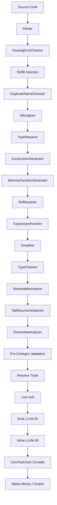

# MinnieML: Compiler Implementation

This document describes how the MML compiler processes programs: the tree it works on, the main
rewrites it performs, and how those rewrites flow into codegen.

The compiler uses one evolving AST from parsing through codegen. There is no separate core tree or
mid-level IR between the frontend and backend. Phases keep rewriting the same lambda-shaped model:
they add synthetic nodes, assign stable IDs, record captures, attach metadata, insert ownership
wrappers, and annotate types in place.

## Table of contents
6. [AST structure](#6-ast-structure)
7. [Parser architecture](#7-parser-architecture)
8. [Semantic phase pipeline](#8-semantic-phase-pipeline)
9. [Standard library injection](#9-standard-library-injection)
10. [Error handling strategy](#10-error-handling-strategy)
11. [Code generation: native templates](#11-code-generation-native-templates)
12. [Code generation: struct constructors](#12-code-generation-struct-constructors)
Appendix A. [Source tree overview](#appendix-a-source-tree-overview)

---

## 6. AST structure

The Abstract Syntax Tree is organized into several node categories.

### Core traits

#### `AstNode`
Base trait for all AST nodes.

#### `FromSource`
Nodes that have source location information (`SrcSpan`).

#### `Typeable`
Nodes that can have types, containing:
- `typeSpec: Option[TypeSpec]` - **Computed type** by the compiler
- `typeAsc: Option[TypeSpec]` - **User-declared type** from source

#### `Resolvable`
Nodes that can be referenced by name (all `Decl` types, `FnParam`). Each `Resolvable` (and
`ResolvableType`) carries a stable `id: Option[String]` used for soft references.

### Module structure

```scala
Module(
  span: SrcSpan,
  name: String,
  visibility: Visibility,  // Public, Protected, Private
  members: List[Member],
  docComment: Option[DocComment],
  sourcePath: Option[String],
  resolvables: ResolvablesIndex
)
```

- **Top-level modules**: The CLI/test harness always provides a module name derived from the source path; there is no `module` keyword at file scope. The parser simply collects top-level members until EOF and wraps them in a `Module` with `Visibility.Public`.
- **Doc comments**: File-level doc comments apply to the first member; the parser does not attach them to the synthetic top-level module node.
- **Visibility**: Three levels (`Public`, `Protected`, `Private`) are carried in the AST for future access control; not enforced yet. See semantics doc for meaning.

### Members

Top-level declarations in a module:

#### Declarations (`Decl`)
All declarations extend `Decl` trait and include:
- `Bnd` - All value bindings, functions, and operators (with `Lambda` body and optional `BindingMeta`)
- `TypeDef` - New type definitions
- `TypeAlias` - Type aliases

**Bnd with BindingMeta**: Functions and operators are represented as `Bnd` nodes containing a `Lambda` body and `BindingMeta`:
```scala
Bnd(
  name: String,           // mangled name for operators (e.g., "op.plus.2")
  value: Expr,            // contains Lambda with params and body
  meta: Option[BindingMeta], // origin, arity, precedence, associativity, originalName, inlineHint
  id: Option[String]         // stable soft-reference ID
)
```


### Terms

Expressions are built from terms:

#### Expression structures
- **`Expr`**: Sequence of terms that form an expression
- **`TermGroup`**: Parenthesized expression `(expr)`
- **`Cond`**: Conditional expression `if cond then expr1 else expr2`
- **`App`**: Function application (curried: `f x y` becomes `((f x) y)`)
  - Note: `fn` field is constrained to `Ref | App | Lambda`; parser-lowered scoped bindings and
    direct lambda application rely on the `Lambda` case.
- **`Lambda`**: First-class callable value used for:
  - top-level `fn` / `op` bodies wrapped in `Bnd`
  - literal lambdas (`{ x -> body }`, `~{ x -> body }`)
  - local `fn` sugar lowered by the parser to a scoped binding of a `Lambda`
  - synthetic statement / let wrappers introduced during parsing and later rewrites
  - Carries `params`, `body`, `captures`, optional `LambdaMeta`, and `isMove` for explicit move
    capture syntax

#### Closure captures

```scala
enum Capture:
  case CapturedRef(ref: Ref)
  case CapturedLiteral(ref: Ref, cloneFnId: String)
```

- `CapturedRef` is the regular capture path.
- `CapturedLiteral` marks a captured value that must be cloned when the closure environment is
  materialized.
- The parser always emits `captures = Nil`; later semantic phases discover, classify, and type
  captures.

#### Values
- **`Ref`**: Reference to a declaration or parameter
  - Contains `resolvedId: Option[String]` - ID of the resolved target (soft reference)
  - Contains `candidateIds: List[String]` - potential resolution IDs during name resolution
- **`LiteralInt`, `LiteralFloat`, `LiteralString`, `LiteralBool`, `LiteralUnit`**
- **`Tuple`**: Tuple of expressions `(expr1, expr2, ...)`
- **`Placeholder`**: Pattern matching placeholder `_`
- **`Hole`**: Typed hole `???` (for incomplete code)

#### Marker nodes
- **`DataConstructor`**: Marker node for struct constructor bodies. This is NOT a callable
  function—it signals to codegen that the enclosing function should emit struct assembly
  (alloca, store fields, load, return). The constructor's parameters become the field values.
  Only appears as the sole term in a generated `__mk_StructName` function body.
- **`DataDestructor`**: Vestigial marker, currently unused. Was planned for struct destructors
  but the approach changed to generating `__free_T` as regular AST with `App` nodes.

### Type Specifications (`TypeSpec`)

```scala
// Type references
TypeRef(name: String, resolvedId: Option[String], candidateIds: List[String])

// Native types (from C/LLVM)
NativePrimitive(llvmType: String)        // e.g., "i64", "float"
NativePointer(llvmType: String)          // e.g., "*i8"
NativeStruct(fields: Map[String, TypeSpec])

// Function types
TypeFn(paramTypes: List[TypeSpec], returnType: TypeSpec)

// Compound types
TypeTuple(elements: List[TypeSpec])
TypeStruct(fields: List[(String, TypeSpec)])
Union(types: List[TypeSpec])             // Int | String
Intersection(types: List[TypeSpec])      // Readable & Writable
TypeApplication(base: TypeSpec, args: List[TypeSpec])

// Type schemes (polymorphism)
TypeScheme(vars: List[String], bodyType: TypeSpec)  // ∀'T. 'T → 'T
TypeVariable(name: String)                          // 'T, 'R, etc.
```

- **Type definitions**: `TypeDef`, `TypeAlias`, and `TypeStruct` are `ResolvableType` nodes with
  stable IDs; `Field` (struct fields) is also `Resolvable` and carries an ID.

### Error/invalid nodes

For error recovery and LSP support:

- **`InvalidExpression`**: Wraps unresolvable expressions
- **`InvalidType`**: Wraps unresolvable type references
- **`DuplicateMember`**: Marks duplicate declarations
- **`InvalidMember`**: Members with structural errors
- **`ParsingMemberError`**: Parse errors at member level
- **`TermError`**: Expression-level parse errors

### Soft references and ResolvablesIndex

- All resolvable nodes (top-level declarations, struct fields, lambda parameters) carry stable IDs.
- `Ref`/`TypeRef` store those IDs (`resolvedId`/`candidateIds`) instead of object references.
- `Module.resolvables: ResolvablesIndex` maps IDs to the current AST nodes and is kept in sync as
  phases rewrite members. Consumers (LSP, codegen, printers) always reify through this index to get
  the latest node instance.

---

## 7. Parser architecture

The parser uses **FastParse** combinators.

### Whitespace handling

- **No significant indentation**: Whitespace is not syntactically meaningful
- **Custom whitespace handler** (`MmlWhitespace`):
  - Consumes spaces, tabs, newlines, carriage returns
  - Handles line comments starting with `//` (e.g., `// this is a comment`)
  - Preserves `/*` and `*/` tokens for doc comment parser

**Implementation**: State machine with two states:
- State 0: Normal whitespace consumption
- State 1: Inside line comment (consume until newline)

### Expression parsing strategy

Expressions are parsed as **sequences of terms** that are later restructured by the `ExpressionRewriter` phase using precedence climbing.

**Example**:
```mml
let result = 1 + 2 * 3;
```
- **Parser output**: `Expr(terms = [Ref("1"), Ref("+"), Ref("2"), Ref("*"), Ref("3")])`
- **After ExpressionRewriter**: Properly nested `App` nodes respecting precedence

**Rationale**: This approach simplifies parsing and defers precedence handling to semantic analysis, enabling better error recovery and making operator precedence extensible.

### Lambda and local-binding lowering

The parser now emits real `Lambda` terms in expression position.

#### Literal lambdas

Surface syntax:

```mml
{ x -> x + 1 }
~{ x -> mk_user x }
{ println "side effect" }
```

- `{ ... }` creates a borrow-capturing closure by default.
- `~{ ... }` creates a move-capturing closure.
- Parameterless lambdas are allowed.
- Lambda bodies are terminated by `;` or implicitly by the closing `}`.

#### Local `let`

Expression-local bindings are lowered directly to immediate lambda application:

```mml
let x = value;
rest
```

Conceptually:

```mml
({ x -> rest } value)
```

The parser builds this directly as `App(fn = Lambda(...), arg = value)`. Later phases treat that
shape as scoped-binding sugar rather than as an ordinary closure literal.

#### Local `fn`

Inner functions use the same scoped-binding lowering strategy:

```mml
fn helper(a: Int): Int = a + 1;
helper 41
```

The bound value is a `Lambda`. When parameter and return annotations are available, the parser also
synthesizes a `TypeFn` ascription for the local binding. That keeps local `fn` and let-bound
lambdas on the same path in later phases.

#### Statement sequencing

Expression sequences are also lowered immediately by the parser using the same scoped-lambda model.

Surface syntax:

```mml
expr1;
expr2;
expr3
```

is lowered conceptually to nested immediate applications:

```mml
({ __stmt: Unit ->
   ({ __stmt: Unit ->
      expr3
    } expr2)
 } expr1)
```

The parser builds this shape directly with a synthetic `__stmt` parameter and nested
`App(fn = Lambda(...), arg = ...)` nodes. It is CPS-like in the narrow sense that each statement
runs before the rest of the expression continues. It still targets the same AST the compiler uses
everywhere else.

### Member parsing

Top-level module members are parsed independently:
- `fnKw` → `Bnd` with `Lambda` body and `BindingMeta(origin=Function)`
- `opKw` → `Bnd` with `Lambda` body and `BindingMeta(origin=Operator)`
- `letKw` → `Bnd` (no meta for simple value bindings)
- `typeKw` → `TypeDef` or `TypeAlias`
- `structKw` → `TypeStruct`

An optional `inline` keyword before `fn` or `op` sets `BindingMeta.inlineHint = true`.
Codegen emits the LLVM `inlinehint` function attribute for these declarations.

### Struct constructor synthesis

Constructor `Bnd` nodes are generated by `ConstructorGenerator`, a semantic phase that runs
after `TypeResolver` and before `MemoryFunctionGenerator`. See Semantic Phase 4 below for
details.

- **Name**: `__mk_StructName` (stored in `BindingMeta.mangledName`). The struct's own name is
  kept in `BindingMeta.originalName` so `RefResolver` can match `User x y` to `__mk_User`.
- **Parameters**: One `FnParam` per struct field, preserving field names and type ascriptions.
- **Body**: A single `DataConstructor` term with the struct's return type. This marker tells
  codegen to emit struct assembly rather than compiling a regular function body.
- **Metadata**: `origin = BindingOrigin.Constructor`, arity derived from field count
  (Nullary/Unary/Binary/Nary), `precedence = Precedence.Function`.
- **Visibility**: Inherited from the struct definition.

The resulting `Bnd` wraps a `Lambda` (params + body) just like user-written functions, so
all downstream phases (RefResolver, TypeChecker, etc.) process it uniformly.

---

## 8. Stages and semantic pipeline

The compiler now runs as a series of **stages**, each composed of timed **phases** that transform a
shared `CompilerState`. Stages today:
- **IngestStage**: parse source, collect parser counters, and lift parse errors.
- **SemanticStage**: rewrite the AST and resolvables index through semantic phases.
- **CodegenStage**: validate, resolve target info, emit IR, and optionally build native artifacts.

`CompilerState` is the single threaded state that flows across all stages:

```scala
case class CompilerState(
  module:         Module,
  sourceInfo:     SourceInfo,
  config:         CompilerConfig,
  errors:         Vector[CompilationError],
  warnings:       Vector[CompilerWarning],
  timings:        Vector[Timing],
  counters:       Vector[Counter],
  entryPoint:     Option[String] = None,
  canEmitCode:    Boolean = false,
  llvmIr:         Option[String] = None,
  nativeResult:   Option[Int] = None,
  resolvedTriple: Option[String] = None
)
```

Each phase takes a `CompilerState`, returns an updated `CompilerState`, and records timing through
`CompilerState.timePhase` / `timePhaseIO`.

`SemanticStage.rewrite` runs after stdlib injection and wires phases in this order:
0. **Stdlib injection**: Adds prelude types, operators, and functions (with stable `stdlib::<name>` IDs).
1. **DuplicateNameChecker**
2. **IdAssigner**
3. **TypeResolver**
4. **ConstructorGenerator**
5. **MemoryFunctionGenerator**
6. **RefResolver**
7. **ExpressionRewriter**
8. **Simplifier**
9. **CaptureAnalyzer**
10. **TypeChecker**
11. **ClosureMemoryFnGenerator**
12. **ResolvablesIndexer**
13. **TailRecursionDetector**
14. **OwnershipAnalyzer**
15. **ResolvablesIndexer (final)**

---

### IngestStage: ParsingErrorChecker

**Purpose**: Report any parse errors that were recovered from during parsing.

**Behavior**:
- Scans module for `ParsingMemberError` and `ParsingIdError` nodes
- Converts them to semantic errors for uniform error reporting
- **Runs FIRST** to surface syntax errors immediately

**Errors reported**:
- `SemanticError.MemberErrorFound`
- `SemanticError.ParsingIdErrorFound`

**AST rewrites**: None, only reports errors

---

### Semantic Phase 1: DuplicateNameChecker

**Purpose**: Detect and report duplicate declarations within a module.

**Behavior**:
- Groups declarations by `(name, kind)` key using `BindingMeta`:
  - Operators: grouped by `(originalName, arity)` - allows unary and binary with same symbol
  - Functions: grouped by name
  - Bindings without meta: grouped by name
- Allows **unary and binary operators** with the same name (e.g., unary `-` and binary `-`)
- **Does NOT allow** functions to have the same name as operators
- First occurrence is kept valid, duplicates are wrapped in `DuplicateMember` nodes
- Also checks for **duplicate parameter names** within functions/operators (via Lambda params)

**Errors reported**:
- `SemanticError.DuplicateName`

**AST rewrites**:
- Wraps duplicate members in `DuplicateMember` nodes
- Wraps members with duplicate parameters in `InvalidMember` nodes

---

### Semantic Phase 2: IdAssigner

Assigns stable IDs to user declarations and lambda parameters, then seeds the resolvables index
before any name or type resolution runs.

**Errors reported**: None

**AST rewrites**:
- Populates `id` fields for decls, params, and struct fields
- Seeds `Module.resolvables` with the freshly assigned IDs

---

### Semantic Phase 3: TypeResolver

**Purpose**: Resolve all `TypeRef` nodes to their type definitions.

**Three-phase resolution**:

1. **Build type map**: Collect all `TypeDef` and `TypeAlias` into a map
2. **Resolve type map**: Resolve `TypeRef` nodes within the definitions themselves (handles nested types like `NativeStruct` fields)
3. **Resolve members**: Resolve all `TypeRef` nodes in member declarations and expressions

**Behavior**:
- Resolves `TypeRef` nodes in:
  - Type ascriptions (`typeAsc`)
  - Function parameter types
  - Return type declarations
  - Type alias definitions
  - Struct field types
- Computes `typeSpec` for `TypeAlias` by following the chain
- Handles recursive type resolution in compound types (`TypeFn`, `TypeStruct`, etc.)

**Errors reported**:
- `SemanticError.UndefinedTypeRef`

**AST rewrites**:
- Updates `TypeRef.resolvedId` to point at the resolved `TypeDef` or `TypeAlias`
- Computes `TypeAlias.typeSpec` by following resolution chain
- Wraps unresolvable type refs in `InvalidType` nodes

---

### Semantic Phase 4: ConstructorGenerator

**Purpose**: Generate synthetic constructor `Bnd` nodes for each `TypeStruct` declaration.

**Behavior**:
- Walks all module members looking for `TypeStruct` definitions.
- For each struct, inserts a `__mk_StructName` `Bnd` immediately after the `TypeStruct` member.
- The generated `Bnd` contains a `Lambda` with one `FnParam` per field, a `DataConstructor`
  body, and `BindingMeta` with `origin = Constructor`.

**AST rewrites**:
- Inserts new constructor `Bnd` members into the module member list
- Updates `resolvables` index with new constructor IDs

---

### Semantic Phase 5: MemoryFunctionGenerator

**Purpose**: Generate memory helpers for user-defined structs with heap fields and rewrite
constructors so ownership transfer is visible in the callable signature.

**Behavior**:
- Scans module members for `TypeStruct` definitions that are heap types directly or transitively
  through their fields.
- Generates:
  - `__free_StructName(~s: StructName): Unit`
  - `__clone_StructName(s: StructName): StructName`
- Rewrites generated constructors so heap-typed fields become `consuming = true` parameters while
  value-type fields stay borrowed.
- Leaves native heap types to the runtime / stdlib path.

**Why it runs here**:
- It needs resolved field types from `TypeResolver`.
- `RefResolver`, `TypeChecker`, and `OwnershipAnalyzer` must see the generated helpers and the
  rewritten consuming constructor parameters.

**AST rewrites**:
- Adds generated `__free_*` and `__clone_*` `Bnd` members to the module
- Rewrites constructor params to mark heap fields as consuming
- Extends the resolvables index with the synthetic helpers

---

### Semantic Phase 6: RefResolver

**Purpose**: Resolve `Ref` nodes to declarations or parameters using stable IDs.

**Behavior**:
- For each `Ref` in expressions, searches for matching declarations in this order:
  1. parameters currently in scope, including parser-lowered local scoped bindings
  2. module-level members
- Populates `Ref.candidateIds` with all matching stable IDs.
- If exactly one match is found, writes that ID to `Ref.resolvedId`.
- If no matches are found, wraps the expression in `InvalidExpression`.

**Errors reported**:
- `SemanticError.UndefinedRef`

**AST rewrites**:
- Updates `Ref.candidateIds` and `Ref.resolvedId`
- Wraps unresolvable references in `InvalidExpression` nodes

---

### Semantic Phase 7: ExpressionRewriter

**Purpose**: Restructure expressions using precedence climbing to build proper AST structure for
operators and function application.

**Algorithm**: Precedence climbing with support for:
1. Prefix operators (unary with right associativity)
2. Function application chains (left-associative juxtaposition)
3. Binary operators (with user-defined precedence)
4. Postfix operators (unary with left associativity)

**Function application as juxtaposition**:
Function application is treated as a high-precedence operation through juxtaposition.

**Example**: `f x y` is parsed as terms `[Ref("f"), Ref("x"), Ref("y")]` and rewritten to
`App(App(Ref("f"), x), y)`.

**Nullary function handling**:
Nullary functions are called explicitly with `()`; value position keeps a reference:
```mml
fn get_value(): Int = 42;
let x = get_value ();
let f = get_value;
```

**Transformations**:
- `1 + 2 * 3` → `App(App(Ref("+"), 1), App(App(Ref("*"), 2), 3))`
- `f x y` → `App(App(Ref("f"), x), y)`
- `-5` → `App(Ref("-"), 5)`

**Errors reported**:
- `SemanticError.InvalidExpression`
- `SemanticError.DanglingTerms`
- `SemanticError.InvalidExpressionFound`

**AST rewrites**:
- Transforms flat `Expr(terms)` into nested `App` structures
- Resolves operator references to their definitions
- Leaves nullary references untouched; explicit `()` remains an application

---

### Semantic Phase 8: Simplifier

**Purpose**: Simplify AST structure by removing unnecessary nesting.

**Transformations**:
- **Unwrap single-term expressions**: `Expr([term])` → `term`
- **Remove group wrappers**: `TermGroup(inner)` → inner term
- **Flatten nested expressions**: Recursively simplify all subexpressions

**Examples**:
```scala
// Before: Expr([Expr([Expr([Ref("x")])])])
// After:  Ref("x")

// Before: TermGroup(Expr([Ref("x")]))
// After:  Ref("x")
```

**Behavior**:
- Recursively simplifies all terms
- Preserves `Expr` wrapper for member bodies and conditional branches
- Transfers type ascriptions when unwrapping

**AST rewrites**:
- Removes unnecessary `Expr` and `TermGroup` nesting
- Flattens AST for easier processing in later phases

---

### Semantic Phase 9: CaptureAnalyzer

**Purpose**: Fill in `Lambda.captures` for real closure literals.

**Key distinction**:
- Not every `Lambda` node is a closure boundary.
- Parser-lowered scoped bindings, statement chains, and let-desugaring do produce
  `App(fn = Lambda(...), arg = ...)` nodes whose `Lambda` acts as a scope-extending wrapper rather
  than as a closure value.
- User code can also produce `App(fn = Lambda(...), arg = ...)` directly through immediate lambda
  application, for example `{ x -> x + a } 1`.
- A `Lambda` in standalone value position is treated as a real closure literal.

**Behavior**:
- Runs after `RefResolver`, so capture discovery works from `resolvedId`s instead of raw names.
- Tracks local scope IDs introduced by enclosing lambdas and parser-lowered scoped bindings.
- Collects:
  - **Direct captures**: refs in the lambda body that resolve to bindings from an enclosing local
    scope
  - **Propagated captures**: refs captured by nested lambdas that must also be carried by the
    enclosing lambda env
- Deduplicates captures by resolved ID and records them as `Capture.CapturedRef`.

**AST rewrites**:
- Rewrites nested lambda bodies where needed
- Populates `Lambda.captures`

---

### Semantic Phase 10: TypeChecker

**Purpose**: Validate member bodies, require parameter annotations where needed, and infer return
types when possible.

**Two-phase flow**

1. **Lower mandatory ascriptions**
   - For `Bnd` with `BindingMeta` (functions/operators), copy each lambda parameter's `typeAsc`
     into `typeSpec` and do the same for the declaration's return type.
   - Missing parameter annotations raise `MissingParameterType` or
     `MissingOperatorParameterType`. Return types may be inferred, so no warning is emitted if they
     are omitted.

2. **Type-check members**
   - Each function/operator body (`Lambda`) is checked in the context of its parameters. If a
     return type was declared, the computed type must match unless the body is a `@native` stub.
     Otherwise, the return type is inferred from the body.
   - `Bnd` bindings without meta run through the same expression checker; their `typeSpec` mirrors
     the computed expression type. Explicit `typeAsc` entries are validated against the inferred
     result.

**Application checking**:
- Works over nested `App` chains produced by the rewriter, validating one argument at a time.
- Ensures zero-argument functions in call position accept `Unit`.
- Emits `TypeError.TypeMismatch`, `InvalidApplication`, `UndersaturatedApplication`, or
  `OversaturatedApplication` depending on the shape of the call.

**Additional rules**:
- After checking, a function or operator's `typeSpec` stores its return type; parameter
  `typeSpec` entries hold the concrete argument types.
- Lambda literals participate in both top-down and bottom-up inference:
  - expected callable types seed missing parameter types
  - unresolved lambda params are inferred from body usage when possible
  - typed capture refs are written back into `Lambda.captures`
- Conditional guards must be `Bool`; both branches must agree on type or trigger
  `ConditionalBranchTypeMismatch`.
- Holes (`???`) require an expected type; otherwise `UntypedHoleInBinding` is reported.
- All detected issues are wrapped as `SemanticError.TypeCheckingError` and accumulated in the
  phase state.

**Note on native implementations**:

Functions and operators with `@native` bodies (containing `NativeImpl` nodes) expose native
signatures inside MML's type system. The type checker does not verify those bodies because the
implementation lives outside MML.

**Plain `@native`**: The compiler generates forward declarations for native functions; the linker
resolves them against the runtime or external libraries.

**`@native[tpl="..."]`**: For operators and functions with templates, codegen emits the template
inline at call sites (no function definition generated). See "Native Templates" in the Code
Generation section below.

---

### Semantic Phase 11: ClosureMemoryFnGenerator

**Purpose**: Synthesize closure-environment layouts and free helpers for capturing lambdas.

**Behavior**:
- Runs after capture and type information are available.
- For every capturing lambda, synthesizes a private env struct named `__closure_env_N`.
- Tags the corresponding `Lambda` with `LambdaMeta.envStructName`.
- Emits free helpers for move closures only:
  - `__free___closure_env_N`
  - `__free_closure` when at least one move closure exists

**Environment layout**:
- **Borrow closures** (`{ ... }`):
  - env contains capture fields only
  - no destructor field is stored
  - codegen later stack-allocates the env with `alloca`
- **Move closures** (`~{ ... }`, `fn ~name(...)`):
  - env field `0` is `__dtor: RawPtr`
  - remaining fields are captures
  - codegen later heap-allocates the env with `malloc` and stores the destructor pointer

**Captured literals**:
- `Capture.CapturedLiteral` entries survive this phase so codegen can clone captured heap literals
  or other non-owned values before storing them into move environments.

**AST rewrites**:
- Appends generated env `TypeStruct` members
- Appends generated closure free helpers
- Rewrites lambdas with `LambdaMeta.envStructName`
- Extends the resolvables index with the synthetic types and functions

---

### Semantic Phase 12: ResolvablesIndexer

**Purpose**: Rebuild `Module.resolvables` from the current rewritten module tree.

**Behavior**:
- Reindexes the current `Resolvable` / `ResolvableType` nodes using their stable IDs.
- Ensures downstream phases observe the latest rewritten node instances after typechecking and
  closure-env synthesis.

**AST rewrites**:
- Replaces `Module.resolvables` with a fresh index derived from current members.

---

### Semantic Phase 13: TailRecursionDetector

**Purpose**: Mark top-level and let-bound lambdas that can use the loopified tail-recursive codegen
path.

**Behavior**:
- Detects self-recursion for top-level function bodies represented as `Lambda`s.
- Traverses parser-lowered let-binding chains to find recursive local lambdas as well.
- Writes `LambdaMeta.isTailRecursive = true` when the body qualifies.

**AST rewrites**:
- Rewrites lambda metadata and any nested let-bound lambda bodies updated during traversal.

---

### Semantic Phase 14: OwnershipAnalyzer

**Purpose**: Track ownership of heap-allocated values and insert `__free_*` calls.

**Ownership states**:
- `Owned` — Caller owns the value, must free at scope end
- `Moved` — Ownership transferred, caller must not use
- `Borrowed` — Lent to callee, caller retains ownership
- `Literal` — Compile-time/static value, never freed
- `Global` — Module-level binding with static lifetime; borrow-only in local scopes

**Key behaviors**:

1. **Allocation detection**: Identifies allocating results via:
   - `NativeImpl.memEffect = Alloc`
   - intramodule fixed-point analysis for user functions returning heap values
   - struct constructors, by resolving the callee and checking for a `DataConstructor` body
   - move-capturing closures with non-empty `captures`, because their env allocation is owned

2. **Free insertion**: Uses CPS-style AST rewriting at scope end:
   ```
   let x = alloc(); body  →  let x = alloc(); let __r = body; __free_T x; __r
   ```

3. **Expression temporaries**: Allocating args not bound to variables get synthetic bindings:
   ```
   f (alloc())  →  let __tmp = alloc(); let __r = f __tmp; __free_T __tmp; __r
   ```

4. **Mixed ownership conditionals**: When branches differ in allocation, generates a witness
   boolean:
   ```
   let s = if c then alloc() else "lit"
   →
   let __owns_s = if c then true else false;
   let s = if c then alloc() else "lit";
   // at scope end: if __owns_s then __free_T s else ()
   ```

5. **Return escape**: Bindings that escape through `return` are not freed locally; ownership moves
   to the caller. Static branches in mixed returns are wrapped with `__clone_T`.

6. **Constructor auto-clone**: When calling a constructor with consuming parameters, non-owned
   arguments (literals, borrowed refs, field accesses) are automatically wrapped with
   `__clone_T` at the call site. Owned values move in directly without cloning:
   ```
   let name = make_name();  // owned
   let u = User name 30;    // name moves in, no clone
   let v = User "Alice" 30; // "Alice" auto-cloned (literal → consuming param)
   ```

7. **Closure capture validation**:
   - Borrowed heap bindings cannot be captured into **move** closures.
   - Borrow closures may borrow owned, borrowed, literal, or global bindings. The restriction is on
     escape and ownership transfer, not on borrowing itself.
   - Already-moved heap bindings cannot be captured.
   - Returning a borrow-capturing closure is rejected; escaping closures must be explicit move
     closures (`~{ ... }` / `fn ~name(...)`).
   - Borrowed values passed to consuming params get a dedicated diagnostic.

**Errors reported**:
- `UseAfterMove`
- `ConsumingParamNotLastUse`
- `BorrowedValuePassedToConsumingParam`
- `PartialApplicationWithConsuming`
- `ConditionalOwnershipMismatch`
- `BorrowEscapeViaReturn`
- `CapturedBorrowedHeapBinding`
- `CapturedMovedHeapBinding`
- `BorrowClosureEscapeViaReturn`

---

### Semantic Phase 15: ResolvablesIndexer (final)

**Purpose**: Rebuild the resolvables index one more time after ownership rewriting.

**Why it exists**:
- `OwnershipAnalyzer` can synthesize fresh AST structure such as temporary bindings, inserted
  frees, cloned branches, and wrapper lambdas.
- Diagnostics, LSP, and codegen should all reify IDs against the final rewritten nodes, not a
  pre-ownership tree.

**AST rewrites**:
- Refreshes `Module.resolvables` one last time so it matches the final semantic tree.

---

## 9. Standard library injection

NOTE: This is a stopgap solution until we get library support.

The compiler automatically injects predefined types, operators, and functions into every module before semantic analysis. This injection is implemented in `semantic/package.scala`.

### Injected types

```scala
// Native type definitions with LLVM mappings
Int64, Int32, Int16, Int8      // i64, i32, i16, i8
Float, Double                  // float, double
Bool                           // i1
Char                           // i8
SizeT                          // i64
Unit                           // void
CharPtr                        // i8*
FloatPtr                       // float*
String                         // Struct: { length: Int64, data: CharPtr }
IntArray                       // Struct: { length: Int64, data: CharPtr }
StringArray                    // Struct: { length: Int64, data: CharPtr }
FloatArray                     // Struct: { length: Int64, data: FloatPtr }
Buffer                         // Opaque pointer (i8*)

// Type aliases
Int   → Int64
Byte  → Int8
Word  → Int8
```

### Injected operators

All standard operators are injected as `@native` declarations with LLVM IR templates:

```scala
// Arithmetic (Int → Int → Int)
op *(a: Int, b: Int): Int 80 left = @native[tpl="mul %type %operand1, %operand2"];
op /(a: Int, b: Int): Int 80 left = @native[tpl="sdiv %type %operand1, %operand2"];
op %(a: Int, b: Int): Int 80 left = @native[tpl="srem %type %operand1, %operand2"];
op +(a: Int, b: Int): Int 60 left = @native[tpl="add %type %operand1, %operand2"];
op -(a: Int, b: Int): Int 60 left = @native[tpl="sub %type %operand1, %operand2"];

// Unary arithmetic (Int → Int)
op +(a: Int): Int 95 right = @native[tpl="add %type 0, %operand"];
op -(a: Int): Int 95 right = @native[tpl="sub %type 0, %operand"];

// Comparison (Int → Int → Bool)
op ==(a: Int, b: Int): Bool 50 left = @native[tpl="icmp eq %type %operand1, %operand2"];
op !=(a: Int, b: Int): Bool 50 left = @native[tpl="icmp ne %type %operand1, %operand2"];
op <(a: Int, b: Int): Bool 50 left = @native[tpl="icmp slt %type %operand1, %operand2"];
op >(a: Int, b: Int): Bool 50 left = @native[tpl="icmp sgt %type %operand1, %operand2"];
op <=(a: Int, b: Int): Bool 50 left = @native[tpl="icmp sle %type %operand1, %operand2"];
op >=(a: Int, b: Int): Bool 50 left = @native[tpl="icmp sge %type %operand1, %operand2"];

// Logical (Bool → Bool → Bool)
op and(a: Bool, b: Bool): Bool 40 left = @native[tpl="and %type %operand1, %operand2"];
op or(a: Bool, b: Bool): Bool 30 left = @native[tpl="or %type %operand1, %operand2"];

// Unary logical (Bool → Bool)
op not(a: Bool): Bool 95 right = @native[tpl="xor %type 1, %operand"];

// String concatenation (String → String → String)
op ++(a: String, b: String): String 61 right = concat a b;

// Float arithmetic (Float → Float → Float)
op +.(a: Float, b: Float): Float 60 left = @native[tpl="fadd %type %operand1, %operand2"];
op -.(a: Float, b: Float): Float 60 left = @native[tpl="fsub %type %operand1, %operand2"];
op *.(a: Float, b: Float): Float 80 left = @native[tpl="fmul %type %operand1, %operand2"];
op /.(a: Float, b: Float): Float 80 left = @native[tpl="fdiv %type %operand1, %operand2"];

// Float comparison (Float → Float → Bool)
op <.(a: Float, b: Float): Bool 50 left = @native[tpl="fcmp olt %type %operand1, %operand2"];
op >.(a: Float, b: Float): Bool 50 left = @native[tpl="fcmp ogt %type %operand1, %operand2"];

// Unary float (Float → Float)
op +.(a: Float): Float 95 right = @native[tpl="fadd %type 0.0, %operand"];
op -.(a: Float): Float 95 right = @native[tpl="fneg %type %operand"];
```

### Injected functions

```scala
// I/O
fn print(s: String): Unit = @native;
fn println(s: String): Unit = @native;
fn mml_sys_flush(): Unit = @native;
fn readline(): String = @native;

// String operations
fn concat(a: String, b: String): String = @native[mem=alloc];
fn to_string(n: Int): String = @native[mem=alloc];
fn float_to_str(a: Float): String = @native[mem=alloc];
fn str_to_int(s: String): Int = @native;

// Float math
fn int_to_float(n: Int): Float = @native[tpl="sitofp i64 %operand to float"];
fn float_to_int(f: Float): Int = @native[tpl="fptosi float %operand to i64"];
fn sqrt(x: Float): Float = @native[tpl="call float @llvm.sqrt.f32(float %operand)"];
fn fabs(x: Float): Float = @native[tpl="call float @llvm.fabs.f32(float %operand)"];

// Buffer I/O
fn mkBufferWithFd(fd: Int): Buffer = @native[mem=alloc];
fn flush(b: Buffer): Unit = @native;
fn buffer_write(b: Buffer, s: String): Unit = @native;
fn buffer_writeln(b: Buffer, s: String): Unit = @native;
fn buffer_write_int(b: Buffer, n: Int): Unit = @native;
fn buffer_writeln_int(b: Buffer, n: Int): Unit = @native;
fn buffer_write_float(b: Buffer, n: Float): Unit = @native;
fn buffer_writeln_float(b: Buffer, n: Float): Unit = @native;

// IntArray, StringArray, FloatArray
fn ar_int_new(size: Int): IntArray = @native[mem=alloc];
fn ar_int_set(arr: IntArray, i: Int, value: Int): Unit = @native;
fn ar_int_get(arr: IntArray, i: Int): Int = @native;
// ... unsafe variants, ar_int_len, plus analogous ar_str_* and ar_float_* families
```

**Implementation**: See `injectBasicTypes`, `injectStandardOperators`, and `injectCommonFunctions` in `semantic/package.scala`.

---

## 10. Error handling strategy

### Error accumulation model

The compiler uses an **error accumulation** model rather than fail-fast:
- Errors are collected in `CompilerState.errors`
- Compilation continues even after errors are found
- This enables better IDE support and reporting multiple errors at once

### Invalid nodes

The compiler wraps invalid constructs in special nodes to continue analysis:

- **`InvalidExpression`**: Unresolvable expressions (e.g., undefined references)
- **`InvalidType`**: Unresolvable type references
- **`DuplicateMember`**: Duplicate declarations (first stays valid)
- **`InvalidMember`**: Members with errors (e.g., duplicate parameters)

Partial compilation continues, LSP features work despite errors, and error messages include more context.

### Error types

#### `SemanticError`
General semantic analysis errors (see language-reference.md, Errors)

#### `TypeError`
Type system errors (see language-reference.md, Errors)

All type errors are wrapped as `SemanticError.TypeCheckingError` for uniform handling in the phase pipeline.

## 11. Code generation: native templates

When the compiler encounters a call to a function or operator with `@native[tpl="..."]`, it emits
the template inline rather than generating a function call.

### Template extraction

The codegen extracts templates from the AST:
- **Operators**: `getNativeTemplate()` checks `BindingMeta.arity` (Binary/Unary) and extracts from `NativeImpl.nativeTpl`
- **Functions**: `getFunctionTemplate()` extracts from functions (any arity except operators)

### Template substitution

Templates use placeholders that are substituted at compile time:

| Placeholder | Description | Example |
|-------------|-------------|---------|
| `%type` | LLVM type of first argument | `i64`, `float` |
| `%operand` | Single argument value (unary ops/functions) | `%0` |
| `%operand1`, `%operand2`, ... | Multiple arguments (1-indexed) | `%0`, `%1` |

### Emission process

1. Compile arguments to get LLVM operand values
2. Substitute placeholders in template with actual values
3. Prepend `%result =` to the instruction
4. Emit the instruction inline

**Example**: For `fn ctpop(x: Int): Int = @native[tpl="call i64 @llvm.ctpop.i64(i64 %operand)"]`
called as `ctpop 255`:

```llvm
%1 = call i64 @llvm.ctpop.i64(i64 255)
```

### Use cases

- **LLVM intrinsics**: `llvm.ctpop`, `llvm.sqrt`, `llvm.smax`, etc.
- **Primitive operators**: `add`, `sub`, `mul`, `icmp`, etc.
- **Bitwise operations**: Custom bit manipulation via LLVM instructions

---

## 12. Code generation: struct constructors

When `FunctionEmitter` encounters a `Lambda` whose body is a single `DataConstructor` term,
it dispatches to `compileStructConstructor` instead of the regular expression compiler.

### Emission steps

1. **Allocate**: `alloca %struct.T` on the stack.
2. **Store fields**: For each struct field, compute a `getelementptr` to the field offset and
   `store` the corresponding parameter value. TBAA struct-field tags are attached to each store.
3. **Load and return**: `load %struct.T` from the stack allocation and `ret`.

The constructor trusts that its parameters are already owned (heap-typed params are marked
consuming by `MemoryFunctionGenerator`), so no cloning happens inside the constructor body.

### Example

Given `struct Point { x: Int, y: Int }`, the generated LLVM IR is:

```llvm
define %struct.Point @Point(i64 %0, i64 %1) #0 {
entry:
  %2 = alloca %struct.Point
  %3 = getelementptr %struct.Point, ptr %2, i32 0, i32 0
  store i64 %0, ptr %3          ; x
  %4 = getelementptr %struct.Point, ptr %2, i32 0, i32 1
  store i64 %1, ptr %4          ; y
  %5 = load %struct.Point, ptr %2
  ret %struct.Point %5
}
```

Struct values are semantically value types — they live on the stack and are returned by value.
LLVM's optimizer typically promotes the `alloca`/`load` pair to registers (SROA pass).

---

## Appendix A: source tree overview

### Compilation flow


```mermaid
flowchart TD
    Source[Source Code] --> Parse[Parser]
    Parse --> PEC[ParsingErrorChecker]
    PEC --> Inject[Stdlib Injection]
    Inject --> DNC[DuplicateNameChecker]
    DNC --> IDA[IdAssigner]
    IDA --> TR[TypeResolver]
    TR --> CG[ConstructorGenerator]
    CG --> MFG[MemoryFunctionGenerator]
    MFG --> RR[RefResolver]
    RR --> ER[ExpressionRewriter]
    ER --> S[Simplifier]
    S --> TC[TypeChecker]
    TC --> RI[ResolvablesIndexer]
    RI --> TRD[TailRecursionDetector]
    TRD --> OA[OwnershipAnalyzer]
    OA --> VAL[Pre-Codegen Validation]
    VAL --> RT[Resolve Triple]
    RT --> LI[Llvm Info]
    LI --> EM[Emit LLVM IR]
    EM --> WI[Write LLVM IR]
    WI --> TOOL[LlvmToolchain Compile]
    TOOL --> Binary[Native Binary / Output]
```

### Module organization

**CLI** (`modules/mmlc/`)
- `Main.scala` - Entry point, CLI handling
- `CommandLineConfig.scala` - Command-line argument definitions

**Compiler Library** (`modules/mmlc-lib/`)

- **ast/**: `AstNode.scala` (AST definitions)
- **parser/**: `Parser.scala`, `MmlWhitespace.scala`
- **compiler/**: `IngestStage.scala`, `SemanticStage.scala`, `CodegenStage.scala`, `Compilation.scala`, `FileOperations.scala`
- **semantic/**: Phase implementations (`ParsingErrorChecker`, `DuplicateNameChecker`, `IdAssigner`, `TypeResolver`, `ConstructorGenerator`, `RefResolver`, `ExpressionRewriter`, `Simplifier`, `TypeChecker`, `MemoryFunctionGenerator`, `ResolvablesIndexer`, `TailRecursionDetector`, `OwnershipAnalyzer`) plus stdlib injection in `package.scala`
- **codegen/**: `LlvmIrEmitter.scala`, `LlvmToolchain.scala`, `emitter/*`
- **api/**: `ParserApi.scala`, `SemanticApi.scala`, `FrontEndApi.scala`, `CompilerApi.scala`, `CodeGenApi.scala`, `NativeEmitterApi.scala`
- **lsp/**: LSP server, diagnostics, document manager
- **dev/**: Dev loop utilities
- **errors/**: Phase error types
- **util/**: Pretty-printing, error formatting, pipeline helpers

## Summary

The MML compiler flows through staged pipelines:

1. **IngestStage**: Parse source, collect parser counters, lift parse errors.
2. **SemanticStage**: Stdlib injection → DuplicateNameChecker → IdAssigner → TypeResolver → ConstructorGenerator → MemoryFunctionGenerator → RefResolver → ExpressionRewriter → Simplifier → TypeChecker → ResolvablesIndexer → TailRecursionDetector → OwnershipAnalyzer.
3. **CodegenStage**: Pre-codegen validation → resolve target triple/CPU → gather LLVM tool info → emit LLVM IR → write IR → native compilation.

Each phase takes a `CompilerState` and returns an updated one. Timings are recorded via `CompilerState.timePhase`/`timePhaseIO`. Errors accumulate without halting compilation, so partial results remain available for the LSP.

---

## Reference

- **Codebase structure**: See `memory-bank/systemPatterns.md`
- **Operator overloading**: See `memory-bank/specs/operator-arity-mangling.md`
- **Codegen update**: See `memory-bank/specs/codegen-update.md`
