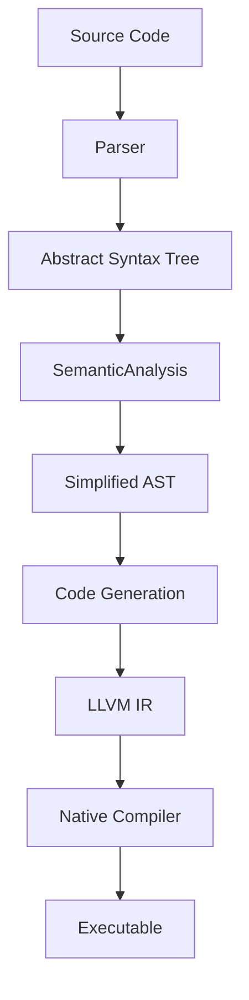

# MML System Patterns

## System Architecture

MinnieML is implemented as a multi-stage compiler with a pipeline architecture. Based on examining the codebase, the compilation process follows these stages:

1. **Parsing**: Converts source code text into an AST (Abstract Syntax Tree)
2. **Semantic Analysis**: Performs checks and transformations on the AST
3. **Code Generation**: Converts the AST to LLVM IR
4. **Native Code Generation**: Converts LLVM IR to executable binaries

The compiler is structured into multiple modules:

- `mmlc`: The compiler frontend and CLI
- `mmlc-lib`: The core compiler implementation

## Key Technical Decisions

### Functional Core Architecture

- The compiler uses a pure functional approach with immutable data structures
- Error handling is done through `Either[CompilationError, T]` for functional error propagation
- Cats and Cats Effect are used for functional programming patterns

### Language Features

- ML-inspired syntax with functional programming paradigm
- Custom operators with defined precedence and associativity
- Pattern matching as a core language feature
- Native integration via `@native` type and function annotations
- Row polymorphism for flexible record types

### Implementation Approach

- Scala 3 with the new syntax style for implementation
- FastParse for parser combinators
- LLVM IR as the compilation target for portability and optimization

### Future Considerations (from Brainstorming)

- **Error Handling:** While currently using `Either` via `CompilerEffect`, brainstorming suggests exploring error accumulation using validation techniques to report multiple errors instead of failing on the first one.
- **Multi-Module Compilation:** A proposed strategy involves parallel parsing, using a shared language database (`lang db`) for symbol tables and references, and performing multiple resolution passes to handle inter-module dependencies before rewriting.

TODO: Add more specific architectural decisions that shaped the system

## Component Relationships

### Key Components

1. **Parser** (`Parser.scala`, `MMLWhitespace.scala`)

   - Handles parsing of MML source code into AST
   - Uses FastParse library with custom whitespace handling

2. **AST** (`AstNode.scala`)

   - Defines the structure for representing MML programs
   - Includes expressions, functions, operators, and more

3. **Semantic Analysis**

   - `DuplicateNameChecker.scala`: Ensures no duplicate definitions exist
   - `RefResolver.scala`: Focuses solely on collecting candidate definitions for each reference
   - `ExpressionRewriter.scala`: Handles all expression structuring in a single pass using precedence climbing. Treats both operators and function applications with the same mechanism. Function application is implemented as juxtaposition with currying (ML-style), where `f a b c` becomes `((f a) b) c` in the AST, with function application having the highest precedence (100). Uses pattern matching extractors (e.g., `IsBinOpRef`, `IsFnRef`) for contextual disambiguation based on candidates from `RefResolver` and term position.
   - `Simplifier.scala`: Simplifies the AST for code generation
   - `MemberErrorChecker.scala`: Validates member references

   Read articles:

   - `docs/articles/2025-02/2025-02-24-custom-operators.md` - Basic operator precedence approach (now outdated)
   - `docs/articles/2025-02/2025-04-12-expression-rewriting.md` - Current unified approach to expression rewriting that treats function application as an implicit high-precedence juxtaposition operator

4. **Code Generation**

   - `LlvmIrEmitter.scala`: Emits LLVM IR from the AST
   - `LlvmOrchestrator.scala`: Coordinates the LLVM code generation process, including:
     - Extracting and compiling the C runtime library for native functions
     - Linking the compiled program with the runtime
     - Supporting both binary and library output modes
   - Native function integration:
     - Functions marked with `@native` annotation are linked to C implementations
     - Types marked with `@native` are mapped to appropriate runtime types (e.g., String)
     - The `mml_runtime.c` provides implementations for standard library functions

5. **CLI Interface** (`Main.scala` and `CommandLineConfig.scala`)

   - Processes command-line arguments
   - Controls the compilation process based on user commands

6. **API** (`mml.mmlclib.api.*` package)
   - Provides external-facing, IO-based APIs built upon each other, threading modules through compilation phases.
   - `ParserApi`: Handles parsing source text into an AST (`CompilerEffect[Module]`).
   - `SemanticApi`: Performs semantic analysis and rewrites on the AST (`CompilerEffect[Module]`).
   - `CompilerApi`: Orchestrates parsing and semantic analysis (`compileString` function), composing `ParserApi` and `SemanticApi`.
   - `CodeGenApi`, `NativeEmitterApi`: Likely handle later stages (details TBD).
   - Uses `CompilerEffect[T]` (an alias for `EitherT[IO, CompilerError, T]`) to manage IO effects and propagate errors functionally using `Either`.

TODO: Add more details about component interactions and dependencies

## Critical Implementation Paths

- **Compilation Pipeline**: The main path from source to executable through the `CompilationPipeline` object
- **Parser to AST**: The translation of source code into structured representation
- **AST to LLVM IR**: The representation of MML constructs in LLVM IR

TODO: Document additional critical paths relevant to understanding the system
