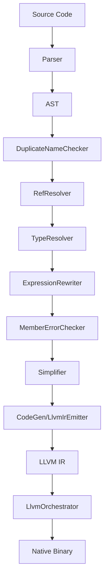

# MML System Patterns

## System Architecture

MinnieML is implemented as a multi-stage compiler with a pipeline architecture. Based on examining the codebase, the compilation process follows these stages:

1. **Parsing**: Converts source code text into an AST (Abstract Syntax Tree)
2. **Semantic Analysis**: Performs checks and transformations on the AST
3. **Code Generation**: Converts the AST to LLVM IR
4. **Native Code Generation**: Converts LLVM IR to executable binaries

The compiler is structured into multiple modules:

- `mmlc`: The compiler frontend and CLI
- `mmlc-lib`: The core compiler implementation

## Key Technical Decisions

### Functional Core Architecture

- The compiler uses a pure functional approach with immutable data structures
- Error handling is done through `Either[CompilationError, T]` for functional error propagation
- Cats and Cats Effect are used for functional programming patterns

### Code Style and Comments

- Comments should ONLY describe functionality, not implementation mechanics
- Avoid inane comments like "start of block" or "end of block" markers
- Keep code clean and avoid distracting structural comments that add no value

### Language Features

- ML-inspired syntax with functional programming paradigm
- Custom operators with defined precedence and associativity
- Pattern matching as a core language feature
- Native integration via `@native` type and function annotations
- Row polymorphism for flexible record types

### Implementation Approach

- Scala 3 with the new syntax style for implementation
- FastParse for parser combinators
- LLVM IR as the compilation target for portability and optimization

### Current Implementation Notes

- **Error Handling:** The compiler accumulates errors through semantic phases using `SemanticPhaseState`, reporting multiple errors instead of failing on the first one
- **Type Resolution:** TypeResolver follows RefResolver pattern, resolving type references throughout the AST
- **Expression Rewriting:** Unified system treats operators and function application uniformly, rewriting operators as curried function applications

## Codebase Structure

### Module Organization

**Compiler Frontend** (`modules/mmlc/`)
- `Main.scala` - Entry point, CLI handling
- `CommandLineConfig.scala` - Command-line argument definitions
- `CompilationPipeline.scala` - Orchestrates the full compilation process
- `CodeGeneration.scala` - Native code generation coordination
- `FileOperations.scala` - File I/O utilities

**Core Compiler Library** (`modules/mmlc-lib/`)

#### AST (`ast/`)
- `AstNode.scala` - All AST node definitions (Module, Member, Expr, Term, TypeSpec, etc.)

#### Parser (`parser/`)
- `Parser.scala` - FastParse-based parser implementation
- `MmlWhitespace.scala` - Custom whitespace handling for significant indentation

#### Semantic Analysis (`semantic/`)
- `package.scala` - `SemanticPhaseState` for error accumulation
- `DuplicateNameChecker.scala` - First phase, checks for duplicate definitions
- `RefResolver.scala` - Collects candidate definitions for each reference
- `TypeResolver.scala` - Resolves type references to type definitions
- `ExpressionRewriter.scala` - Unified precedence-based expression restructuring
- `MemberErrorChecker.scala` - Reports parser errors that made it through
- `Simplifier.scala` - Final AST simplification before codegen

#### Code Generation (`codegen/`)
- `LlvmIrEmitter.scala` - Main LLVM IR generation
- `LlvmOrchestrator.scala` - Coordinates LLVM toolchain, runtime linking
- `emitter/` - Specialized emitters:
  - `ExpressionCompiler.scala` - Expression to LLVM IR
  - `FunctionEmitter.scala` - Function definitions
  - `OperatorEmitter.scala` - Operator definitions
  - `Module.scala` - Module-level emission

#### APIs (`api/`)
- `EffectTypes.scala` - `CompilerEffect[T]` type alias
- `ParserApi.scala` - Parsing API
- `SemanticApi.scala` - Semantic analysis pipeline
- `CompilerApi.scala` - Combined parsing + semantic
- `CodeGenApi.scala` - Code generation API
- `NativeEmitterApi.scala` - Native binary emission

#### Errors (`errors/`)
- Error type definitions for each compilation phase

#### Utilities (`util/`)
- `prettyprint/ast/` - AST pretty printing for debugging
- `error/print/` - Error formatting and display
- `pipe/` - Functional pipeline operator
- `yolo/` - Quick debugging utilities

### Test Structure

**Grammar Tests** (`modules/mmlc-lib/src/test/scala/mml/mmlclib/grammar/`)
- Parser-focused tests for each language construct
- `BaseParserSuite` - Common test utilities

**Semantic Tests** (`modules/mmlc-lib/src/test/scala/mml/mmlclib/semantic/`)
- Tests for each semantic analysis phase
- Integration tests for the full semantic pipeline

**Test Helpers** (`modules/mmlc-lib/src/test/scala/mml/mmlclib/test/`)
- `BaseEffFunSuite` - Base class for effect-based tests
- Common test utilities and assertions

### Key Patterns

- **Functional Core**: Pure functions with explicit error handling via `Either`
- **Effect Separation**: IO effects isolated to API layer using `CompilerEffect`
- **Phase Architecture**: Each semantic phase is a separate module with clear input/output
- **Error Accumulation**: Semantic phases collect errors while continuing analysis
- **AST Rewriting**: Multiple passes transform the AST incrementally

## Compilation Flow

### Entry Points for Understanding

1. **Language Syntax**: Start with `Parser.scala` and example `.mml` files in `mml/samples/`
2. **AST Structure**: Read `AstNode.scala` for all node types
3. **Compilation Pipeline**: Follow `CompilationPipeline.scala` → `SemanticApi.scala`
4. **Error Handling**: See `SemanticPhaseState` in `semantic/package.scala`
5. **Code Generation**: Start with `LlvmIrEmitter.scala`, then specialized emitters
